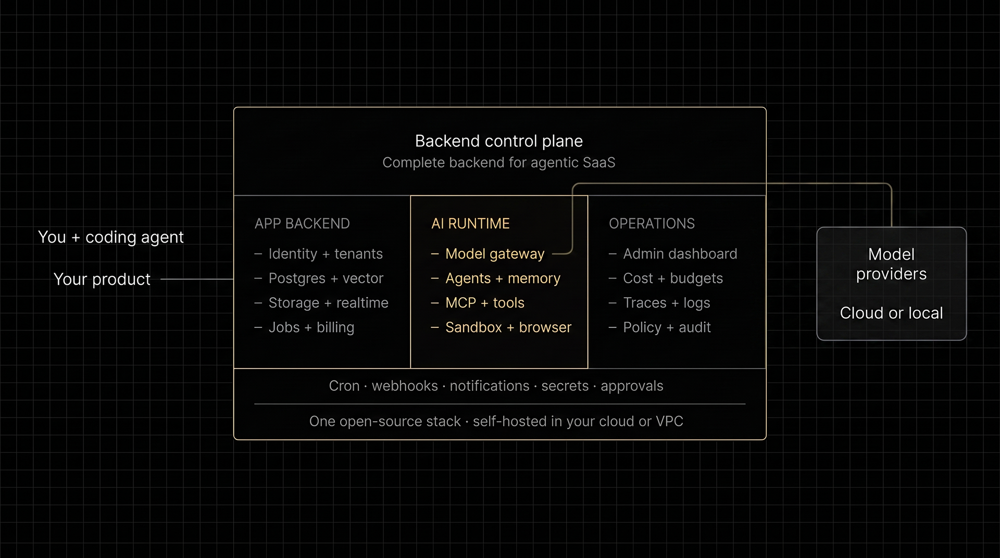
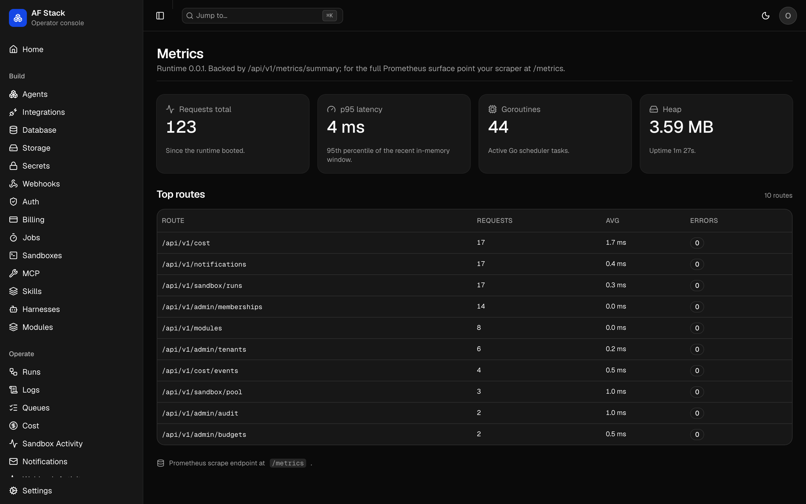
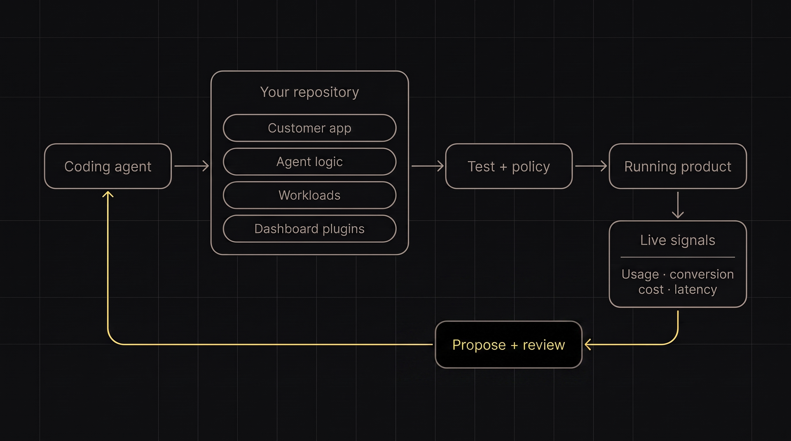
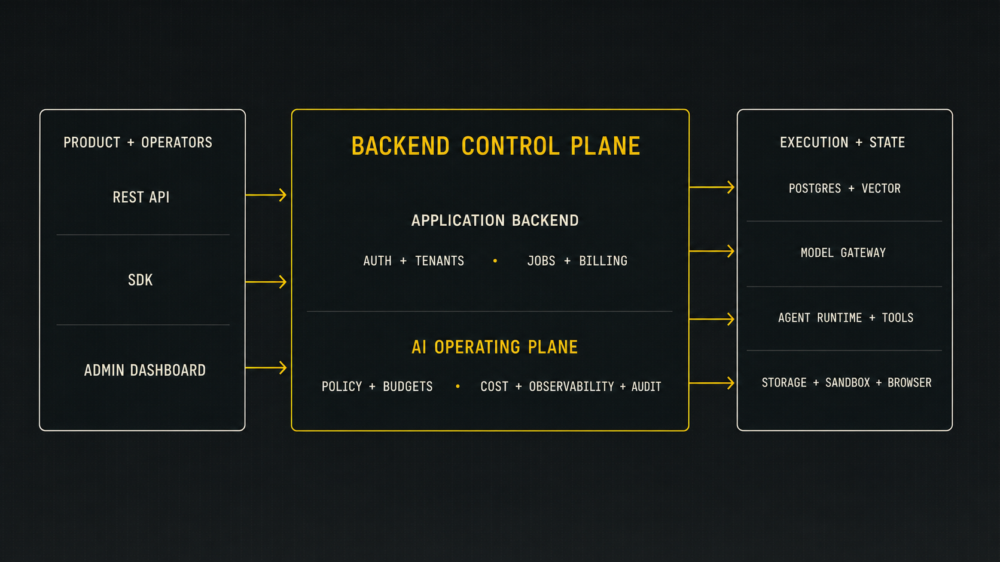

<div align="center">

# BackAI

### The backend for agent-built, agent-powered SaaS.

**Think Supabase for agentic SaaS—with the AI runtime and operating plane
included.** Auth, Postgres, model routing, agent execution, sandboxed execution,
browser automation, durable jobs, billing, cost controls, and observability are
wired together in one open-source, self-hosted stack.

Give a coding agent (Codex, Claude Code, Gemini CLI, OpenCode, or another coding
harness) a backend, not a blank repo. Build the product without assembling the
AI infrastructure. Own the code, data, and deployment.
> [!NOTE]
> **BackAI is in beta and under active development.**
> Expect rapid improvements and the occasional rough edge. If something breaks, feels unclear, or doesn't work as expected, please [open an issue](https://github.com/Agent-Field/backai/issues). Bug reports and feedback help us make BackAI better.

[Quickstart](#quickstart) · [What you get](#what-you-get) · [Build with coding agents](#built-for-coding-agents) · [Docs](docs/dx/README.md)

[](https://github.com/Agent-Field/backai/actions/workflows/ci.yml)
[](#project-status)
[](LICENSE)

</div>

<div align="center">
  
  <br />
  <sub>Included and wired: auth, data, AI runtime, jobs, billing, sandbox, browser, security, and operations.</sub>
</div>

## Quickstart

Prerequisite: Docker with Compose.

```bash
git clone https://github.com/Agent-Field/backai.git
cd backai

# Install the CLI, then start the complete local stack.
curl -fsSL https://raw.githubusercontent.com/Agent-Field/backai/main/scripts/install.sh | bash
af-stack dev
```

Prefer not to pipe an installer into a shell? [Inspect it first](scripts/install.sh)
or run `go install github.com/Agent-Field/backai/services/cli/cmd/af-stack@latest`.

Open the customer app first at `http://localhost:34000`, then inspect what it
did in the operator console at `http://localhost:33000`.

No model key is required. The first run uses a deterministic demo provider but
still exercises the real gateway, tenant context, cost ledger, customer app,
and dashboard. Add an OpenRouter, OpenAI, Anthropic, Gemini, or other supported
provider key when you want live model calls through LiteLLM.

Prefer raw Compose? Run `node scripts/preflight.mjs --fix` and then
`docker compose up`. Preflight resolves local port conflicts and prints every
service URL.

> **Pre-alpha:** the golden path works, but workload auto-mounting and remote
> Python/TypeScript durable-job handlers are not wired yet. [See current limits](#project-status).

## What you get

In the AI era, auth and a database are no longer a complete backend. Products
also need controlled model and agent execution, durable work, cost enforcement,
and observability.

| Primitive            | Wired into BackAI                                                                                                                             |
| -------------------- | --------------------------------------------------------------------------------------------------------------------------------------------- |
| **Identity**         | Users, sessions, tenants, memberships, roles, OAuth, scoped API keys, and row-level tenant isolation                                          |
| **Data**             | Postgres, pgvector, tenant-aware memory, search, realtime, migrations, storage, and an operator database browser                              |
| **Models**           | OpenAI-compatible gateway, provider routing, streaming, embeddings, cache, guardrails, budgets, and model-level cost records                  |
| **Agents**           | Multi-reasoner execution, streaming, approvals, cancellation, durable jobs, crons, webhooks, and run traces                                   |
| **Agent tools**      | Isolated sandboxes, browser adapters, MCP servers, native tools, skills, secrets, and coding-harness discovery                                |
| **Commercial layer** | Usage metering, cost ledger, per-tenant budgets, plan entitlements, and Stripe-shaped billing                                                 |
| **Operations**       | Admin dashboard for traffic, errors, spend, budgets, queues, runs, traces, logs, webhooks, customers, audit, integrations, and service health |
| **Product shell**    | A customer-facing Next.js app and SupportDesk AI flow that can be replaced with your product                                                  |
| **Delivery**         | One CLI-managed Compose stack plus production recipes for Helm, Fly.io, Railway, Render, and a private VM or VPC                              |

These are one system, not a catalog of disconnected containers. Tenant identity
flows through model calls, jobs, storage, billing, audit, and cost so builders do
not have to recreate those connections for every product. Model and agent
engines remain replaceable; the product is the secure wiring around them.

### Operate what you ship

Cost, latency, failures, queues, tenants, and audit are first-class backend
state—not separate dashboards developers must assemble later.

<table>
  <tr>
    <td width="50%">
      
      <br />
      <sub>Spend, budgets, forecasts, and cost by model, agent, or tenant.</sub>
    </td>
    <td width="50%">
      
      <br />
      <sub>Request volume, latency, runtime resources, routes, and errors.</sub>
    </td>
  </tr>
</table>

## What can you build?

- Multi-tenant copilots with per-customer identity, usage, and budgets
- Support, operations, research, extraction, and document products
- Long-running coding-agent and approval-driven workflows
- AI features attached to an existing web, mobile, or backend application

Start from the neutral [`examples/starter/`](examples/starter/), the bundled
SupportDesk product, or a focused example: [LLM gateway](examples/03-llm-gateway-only/),
[multi-tenant notes](examples/01-notable/),
[deep research](examples/06-deep-research/), or
[coding agents](examples/02-shipwright/).

## Built for coding agents

BackAI is designed to be handed to coding agents (Codex, Claude Code, Gemini
CLI, OpenCode, and others) after initialization. The repo includes `AGENTS.md`,
`CLAUDE.md`, and a versioned BackAI skill that explain the architecture, safe
edit boundaries, SDKs, and verification workflow.

Repo access is not runtime authority. Scoped keys, tenant policy, budgets,
approvals, sandbox limits, and audit records keep build and live operations
inside explicit boundaries.

```bash
# Scaffold a small app that consumes a BackAI deployment.
af-stack init my-ai-product

# Or customize a full fork and give it to your coding agent.
af-stack init --name "Acme AI" --color "#2563EB" --logo ./logo.png
af-stack agent new researcher
```

Inside a fork, builders and agents usually edit only four surfaces:

| Surface          | Path                           | Purpose                                    |
| ---------------- | ------------------------------ | ------------------------------------------ |
| Customer product | `apps/customer-app/`           | End-user UI and product flows              |
| Agent            | `apps/backend/agents/<name>/`  | AgentField reasoners and agent logic       |
| Workload module  | `workload-modules/<id>/`       | Domain routes, jobs, crons, and migrations |
| Dashboard plugin | `apps/dashboard/plugins/<id>/` | Product-specific operator views            |

The platform runtime stays behind those boundaries. Existing apps can skip the
customer shell and [attach BackAI as a backend](docs/attach-existing-app.md).

<div align="center">
  
</div>

### Build, operate, improve

BackAI records backend signals such as usage, latency, errors, model cost, and
tenant activity. Connect product analytics such as PostHog through APIs,
webhooks, MCP servers, or a custom integration instead of duplicating an
analytics platform inside this stack.

A coding agent can correlate those signals and propose changes to prompts,
model routing, UI, onboarding, traffic allocation, entitlements, or pricing
logic. Tests, scoped credentials, budgets, approvals, and audit remain between
a proposal and production. Automate only inside explicit policy boundaries.
High-impact changes such as pricing or traffic shifts should require approval.

## One URL, two compatible interfaces

Use the standard OpenAI SDK by changing its base URL:

```ts
import OpenAI from "openai"

const ai = new OpenAI({
  baseURL: "https://backai.example.com/api/v1/llm",
  apiKey: process.env.BACKAI_API_KEY,
})

const answer = await ai.chat.completions.create({
  model: "qwen/qwen-2.5-72b-instruct",
  messages: [{ role: "user", content: "Summarize this support request." }],
})
```

Use the Suite SDK when you need the rest of the backend:

```python
from af_stack import suite

result = await suite.agents.call("researcher.run", {"topic": "AI backends"})
await suite.memory.put("latest-report", result)
await suite.billing.meter("reports_created", quantity=1)
```

The rule is simple:

- **`app.*` defines reasoners inside an AgentField agent.**
- **`suite.*` calls agents and every other BackAI primitive.**

Python is the canonical full SDK. TypeScript is near parity with documented
differences. REST and OpenAPI work from any language. The Go SDK is a version
stub today, not a usable client. See the [SDK reference](docs/dx/sdk.md).

## Security is a system property

BackAI wires the controls that are easy to omit when teams assemble an AI
backend service by service:

- Postgres row-level tenant isolation and scoped serving roles
- short-lived sessions plus issue, rotate, and revoke flows for API keys
- one LLM gateway for tenant, policy, budget, and audit enforcement
- encrypted secret storage with KMS adapter support
- PII redaction and configurable request/response moderation
- sandbox limits for CPU, memory, timeout, filesystem, and egress
- signed webhooks, replay protection, idempotency, retry, and delivery logs
- audit records for security-sensitive operator mutations
- separate health, readiness, metrics, backup, and restore paths

These defaults remove repeated integration work; they do not make an arbitrary
deployment automatically compliant or secure. Before production, replace all
development secrets, use external Postgres and object storage, choose a
production sandbox adapter, configure backups, TLS, provider keys, monitoring,
and your own threat model. Start with [deployment guidance](docs/deploy.md),
[configuration](docs/CONFIGURATION.md), and [the security policy](SECURITY.md).

## How it fits together

<div align="center">
  
</div>

Every app-level model call should go through `/api/v1/llm/*`. Direct provider
calls bypass BackAI's tenant identity, budgets, cost records, and guardrails.

## Open-source layers

The repository is Apache 2.0 and assembles the stack around open-source
components. Optional model, email, billing, and remote-sandbox providers remain
adapters; they are not a required hosted control plane.

| Layer                | Responsibility                                                             | Current implementation                                                     |
| -------------------- | -------------------------------------------------------------------------- | -------------------------------------------------------------------------- |
| **1. Interfaces**    | Customer app, admin dashboard, API explorer, docs, SDKs, and CLI           | Next.js, React, shadcn/ui, Scalar, Astro Starlight, Python, TypeScript, Go |
| **2. Edge**          | TLS termination and routing                                                | Caddy                                                                      |
| **3. Control plane** | HTTP/OpenAPI, identity, tenancy, authorization, policy, audit, and secrets | Go runtime, better-auth, Postgres RLS, AES-GCM                             |
| **4. AI runtime**    | Model routing, agent execution, memory, tools, and coding harnesses        | LiteLLM, AgentField, MCP, pluggable harnesses                              |
| **5. Execution**     | Durable jobs, crons, webhooks, and isolated code execution                 | River, robfig/cron, Docker, gVisor, Firecracker; optional e2b adapter      |
| **6. Delivery**      | Signed outbound events, notifications, and billing                         | Native Postgres outbox, Lago; optional Resend and Stripe adapters          |
| **7. Observability** | Traces, metrics, structured logs, cost, queues, and service health         | OpenTelemetry, Prometheus, slog, and the admin dashboard                   |
| **8. Data**          | Relational data, vectors, full-text search, queues, and objects            | Postgres 16, pgvector, MinIO or S3-compatible storage                      |

The value is the wiring between layers, not the number of logos. If you use
another open-source package, implement its existing adapter contract where one
exists. If the capability or contract is missing, [open an issue](https://github.com/Agent-Field/backai/issues)
with the use case, project, license, deployment model, and expected interface.
We add maintained OSS when it removes platform work, not merely to grow the
dependency list.

## Self-host it

`af-stack dev` starts the complete local composition. The same open-source
stack can run in your cloud or VPC without a mandatory hosted control plane.
Use your own model keys, Postgres, object storage, secrets, backups, and network
policy. See the [OSS audit](docs/oss-audit.md) for what is included and why.

> The development Compose file mounts the Docker socket for local code
> sandboxes. Do not expose it as a production deployment. Use the production
> Compose/Helm path and a gVisor, Firecracker, or remote sandbox adapter.

Choose the target that matches your operations posture:

| Target           | Best for                                           |
| ---------------- | -------------------------------------------------- |
| Docker Compose   | Local development or one controlled VM             |
| Railway / Render | Fast hosted evaluation and small deployments       |
| Fly.io           | A compact regional deployment                      |
| Helm             | Kubernetes, external state, and production scaling |

See [`deploy/`](deploy/) for the maintained artifacts and
[`docs/deploy.md`](docs/deploy.md) for required secrets, external services,
backups, and production caveats.

## Where it fits

The closest overlap is [InsForge](https://github.com/InsForge/insforge). This
comparison describes each category's primary system boundary, not checkbox
parity; these products evolve quickly.

| Category                                                                                                                                                                                                                            | Primarily owns                                             | This project's boundary                                                                                                                                                      |
| ----------------------------------------------------------------------------------------------------------------------------------------------------------------------------------------------------------------------------------- | ---------------------------------------------------------- | ---------------------------------------------------------------------------------------------------------------------------------------------------------------------------- |
| **Agent-native BaaS** — [InsForge](https://github.com/InsForge/insforge)                                                                                                                                                            | Backend resources that coding agents provision and operate | Closest comparison. This repo adds a deeper runtime and operating plane around tenant-aware agent calls, jobs, billing, cost, audit, sandboxes, and customer/admin surfaces. |
| **General and reactive BaaS** — [Supabase](https://github.com/supabase/supabase), [Appwrite](https://github.com/appwrite/appwrite), [Convex](https://www.convex.dev/)                                                               | Data, auth, storage, functions, and realtime               | Starts with the application foundation, then makes models, agents, jobs, policy, and cost part of the same tenant-aware system.                                              |
| **Agent runtimes and workflow platforms** — [Cloudflare Agents](https://developers.cloudflare.com/agents/), [Xians](https://xians.ai/), [Dify](https://github.com/langgenius/dify), [Flowise](https://github.com/FlowiseAI/Flowise) | Agent execution, state, tools, or visual authoring         | Includes the surrounding SaaS backend, commercial layer, customer shell, and operator plane; the agent runtime is one layer rather than the product boundary.                |
| **Gateways and observability** — [LiteLLM](https://github.com/BerriAI/litellm), [Langfuse](https://github.com/langfuse/langfuse), [Helicone](https://github.com/Helicone/helicone)                                                  | Model routing, traces, evaluations, and cost visibility    | Treats gateway and observability as layers behind identity, tenancy, jobs, billing, audit, and product operations.                                                           |

The bet is not that every component is novel. It is that an agentic SaaS should
not have to assemble and secure these categories independently before it can
ship.

## Project status

BackAI is **pre-alpha**. The current golden path is the SupportDesk first run,
no-key demo mode, OpenAI-compatible gateway, Python/TypeScript SDKs, cost
ledger, customer app, operator console, and self-hosted deployment artifacts.

Two important limits are explicit:

- Workload modules scaffold today, but automatic runtime mounting is not wired.
- Durable jobs execute Go in-process handlers today; remote Python and
  TypeScript job handlers are not implemented yet.

Track shipped behavior in [`docs/product.md`](docs/product.md) and extension
contracts in [`docs/architecture.md`](docs/architecture.md).

## Documentation

- [Developer experience](docs/dx/README.md) — build surfaces, local run, SDK, jobs, and webhooks
- [Architecture](docs/stack.md) — layers, ownership, and OSS composition
- [Repository map](docs/repo-map.md) — what belongs where
- [Attach an existing app](docs/attach-existing-app.md) — gateway and tenant-key integration
- [OSS audit](docs/oss-audit.md) — what BackAI uses and why
- [Examples](examples/) — capability-declared product shapes

## Community

Read [`CONTRIBUTING.md`](CONTRIBUTING.md) before opening a change and use GitHub
Issues for bugs and product proposals. Security reports belong in the private
channel described in [`SECURITY.md`](SECURITY.md).

Apache 2.0. See [`LICENSE`](LICENSE).
