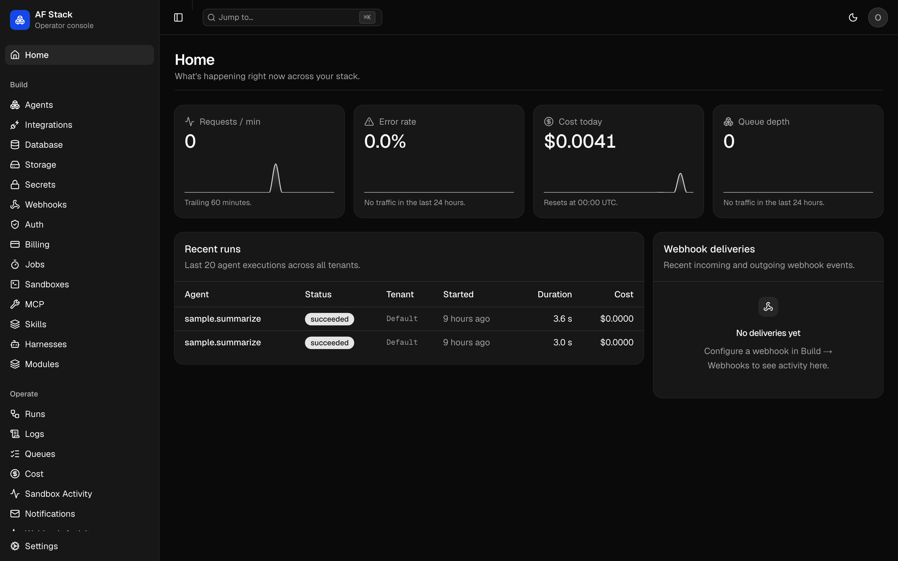
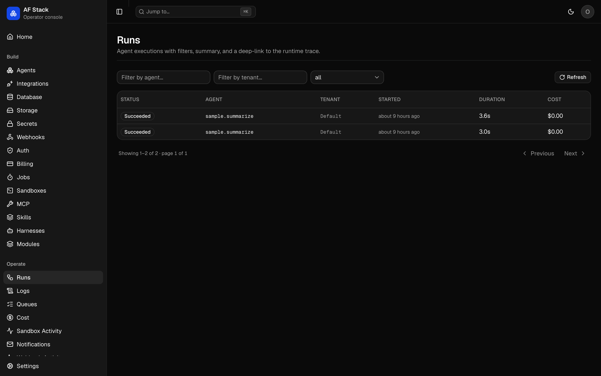
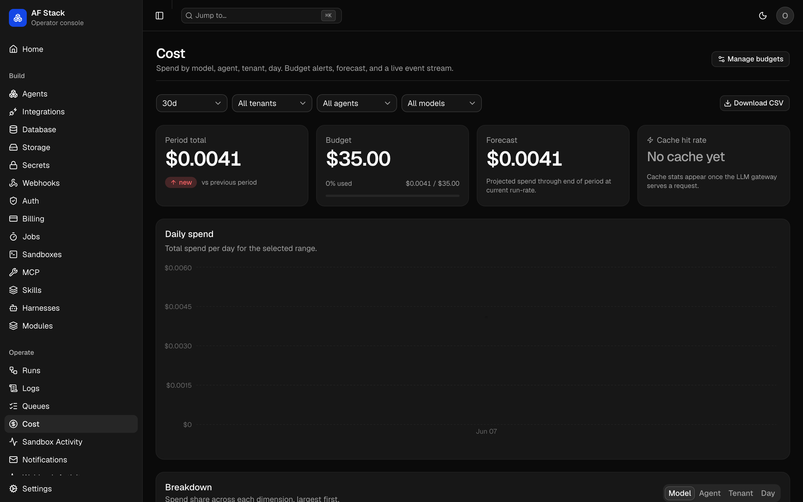
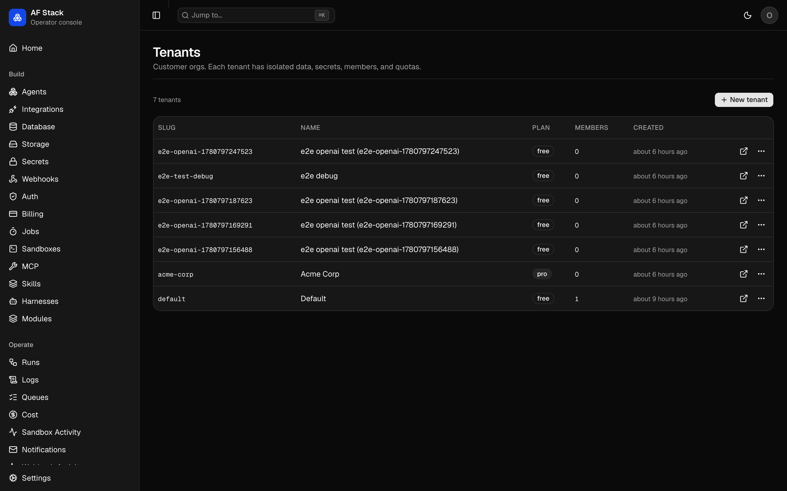
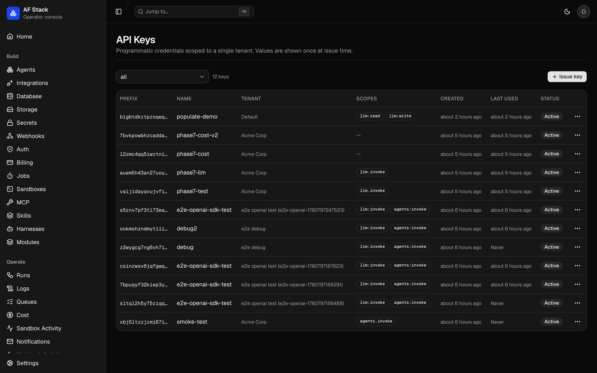
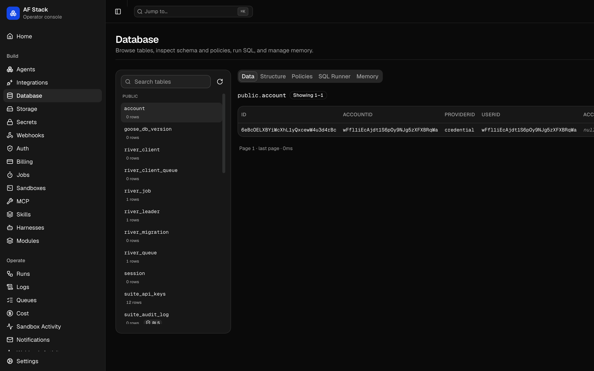
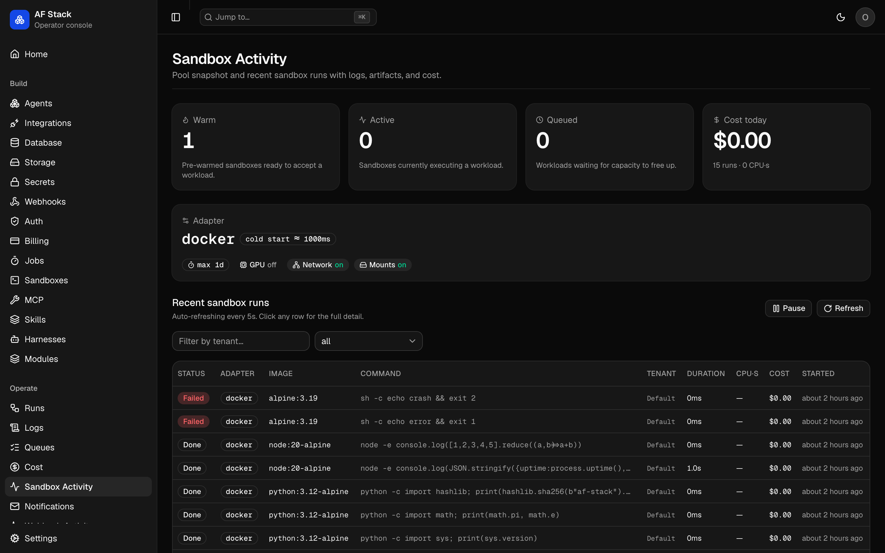

<div align="center">

# BackAI

### The open-source AI app template with the backend already wired.

_Start with SupportDesk AI, then replace the app with your own product._

[](#)
[](LICENSE)
[](https://github.com/Agent-Field/agentfield)

</div>

> **Working name**. The brand is configured in [`brand.yaml`](brand.yaml).

## What this is

BackAI is a fork-friendly AI app template. You clone one repo and get a
customer app, admin dashboard, API runtime, auth, tenants, API keys, LLM
gateway, cost tracking, billing stubs, storage, jobs, agents, and deploy
targets.

The default app is **SupportDesk AI**: a customer-facing support portal
with sign-up, help center, support chat, request history, billing, and
account pages. Admin and platform evidence stay in the operator console,
where builders can inspect usage, cost, runs, and service links after
using the app. Replace the customer app with your own product when you
fork.

The category is the AI backend: the substrate behind AI SaaS apps where
model calls, cost, tenant isolation, jobs, storage, billing, and agent
execution all live together.

## Canonical DX

The default path is **fork and edit**:

```bash
git clone https://github.com/Agent-Field/backai supportdesk-ai
cd supportdesk-ai
# Optional once you replace the default app:
# af-stack init --name "DocuChat" --color "#0A66C2" --logo ./logo.png
docker compose up
```

Your product code lives inside the fork. You brand it, add agents,
customize the customer app, add workload modules, add dashboard plugins,
and deploy the whole thing as one unit.

API-only consumption is supported for mobile apps and existing products,
but it is the secondary path. The primary experience is closer to
Cal.com or Plane than to a hosted BaaS: the repo is the product.

## What You Edit

| Surface           | Path                           | What belongs there                                                  |
| ----------------- | ------------------------------ | ------------------------------------------------------------------- |
| Customer product  | `apps/customer-app/`           | Your end-user UI, flows, pages, and brand-specific app logic.       |
| Agents            | `apps/backend/agents/<name>/`  | Python AgentField agents, reasoners, MCP config, and harness setup. |
| Workload modules  | `workload-modules/<id>/`       | Domain backend routes, migrations, jobs, and crons.                 |
| Dashboard plugins | `apps/dashboard/plugins/<id>/` | Operator-console tabs for your domain metrics and controls.         |

Start with the bundled SupportDesk AI customer app when you want a
polished product-shaped baseline. Use [`examples/starter/`](examples/starter/)
when you want the smallest neutral fork: one agent, one customer-app
flow, one workload module, and one dashboard plugin.

The rest of the repo is organized by ownership: `services/` is platform
runtime code, `packages/` is shared SDK/library code, `deploy/` is
deployment targets, `docs/` is durable product/operator documentation,
`development/` is planning evidence for this branch, and `docs/archive/`
is historical design material. See [`docs/repo-map.md`](docs/repo-map.md).

## Pre-Wired vs Configurable

| Area        | Pre-wired default                             | Configurable by you                                              |
| ----------- | --------------------------------------------- | ---------------------------------------------------------------- |
| Data        | Postgres 16 + pgvector                        | External Postgres, RLS policy shape, workload tables.            |
| Storage     | MinIO in dev, S3 contract in prod             | S3, R2, GCS, Azure Blob via adapter/env.                         |
| Identity    | better-auth, seeded default operator          | OAuth providers, trusted origins, default operator credentials.  |
| LLM routing | AgentField path + LiteLLM sidecar             | Provider keys, model map, budgets, virtual-key strategy.         |
| Sandboxes   | Docker in dev, e2b/gVisor/Firecracker options | Adapter choice, limits, provider credentials.                    |
| Delivery    | Svix for outbound webhooks, log notifications | Resend/Postmark/etc. notifications, billing adapter.             |
| Deploy      | Docker Compose, Helm, Fly, Railway, Render    | Your domains, secrets, scaling, managed services.                |

For the layered architecture and OSS placement, read
[`docs/stack.md`](docs/stack.md). For repo ownership and integration
paths, read [`docs/repo-map.md`](docs/repo-map.md) and
[`docs/attach-existing-app.md`](docs/attach-existing-app.md).

## Why This Exists

Building an AI-native product today means assembling 10+ services: auth,
db, storage, queue, gateway, agent runtime, sandboxes, webhooks, billing,
observability. Each integration costs weeks. Each vendor adds lock-in.

Supabase-shaped backends don't include AI primitives. AI platforms don't
include backend primitives. Builders rebuild the same plumbing for every
project.

BackAI ships both halves. The app template gives you the product
surface. The backend gives you the operational substrate for AI calls,
agents, costs, tenants, jobs, storage, and billing.

## The invariant

**Every app-level model call goes through the BackAI gateway.** No
bypass. The OpenAI-compatible endpoint at `/api/v1/llm/*` preserves
tenant identity, cost, policy, and audit metadata before routing to the
configured provider layer.

## SDK Boundary

> **`app.*` defines agents. `suite.*` calls them and runs everything else.**

| SDK                      | Use inside                                                |
| ------------------------ | --------------------------------------------------------- |
| **AgentField** (`app.*`) | Agent processes                                           |
| **Suite** (`suite.*`)    | App handlers, jobs, dashboard — anywhere outside an agent |

Plus a REST + OpenAPI surface so any language works.

## The operator console

<div align="center">



<sub>Home: requests/min · error rate · cost today · queue depth · live runs</sub>



<sub>Operate → Runs: filter by agent / tenant / status, link out to full trace</sub>



<sub>Operate → Cost: spend by model · agent · tenant · day, with budgets and forecast</sub>


<sub>Customers → Tenants: per-customer drilldown with usage, members, audit</sub>


<sub>Customers → API Keys: issue / rotate / revoke with one-time-reveal</sub>

</div>

## Quickstart (under 60 seconds)

```bash
git clone https://github.com/Agent-Field/backai supportdesk-ai
cd supportdesk-ai
cp .env.example .env
# Optional: set OPENROUTER_API_KEY for live model calls.
node scripts/preflight.mjs
docker compose up
```

Open the customer app first:

- Customer app: `http://localhost:34000`
- Admin dashboard: `http://localhost:33000` — sign in with the default operator account
- API runtime: `http://localhost:8080/api/v1/`
- Health + metrics: `http://localhost:8080/health` · `/ready` · `/metrics`
- AgentField control plane: `http://localhost:8081/`
- MinIO console: `http://localhost:9001/`

As a secondary touchpoint, the API runtime is callable directly with the
same agent the customer app uses internally:

```bash
curl -X POST http://localhost:8080/api/v1/agents/sample.echo \
  -H "Content-Type: application/json" \
  -d '{"input":{"payload":{"message":"hello world"}}}'
# → {"status":"succeeded","result":{"echoed":{"message":"hello world"}}, ...}
```

### Operator login

A default operator account is **seeded on first boot**, so the admin
dashboard is usable immediately — there is no signup wizard.

| Field    | Default                   |
| -------- | ------------------------- |
| Email    | `operator@af-stack.local` |
| Password | `changeme123`             |

**Change the password from the console after your first login.** Override the
defaults before the first `docker compose up` with
`AF_STACK_DEFAULT_OPERATOR_EMAIL` / `AF_STACK_DEFAULT_OPERATOR_PASSWORD` in
`.env` (see [`.env.example`](.env.example)). Seeding only runs while no
operator exists yet, so changing those values later — or changing the
password in the console — is never overwritten on restart. To provision
operators another way, set `AF_STACK_DEFAULT_OPERATOR_DISABLED=true`.

### Port overrides

If a local port is already in use, or if two BackAI services are configured to
publish the same host port, the preflight fails before Docker starts and prints
the exact override to use. Keep unrelated local services running and pick an
unused port instead:

```bash
AF_STACK_PORT=38080 docker compose up
AF_STACK_DASHBOARD_PORT=33001 docker compose up
```

To enable multi-tenancy: set `modules.multi-tenancy.enabled: true` in
`apps/backend/config.yaml`. See [`docs/multi-tenancy.md`](docs/multi-tenancy.md)
for the full guide, including how to run the end-to-end isolation test
(`scripts/test-multi-tenancy.sh`).

Sign up in SupportDesk AI. BackAI provisions the account, membership,
billing record, and internal request credentials. The first-run product
tour then walks you through one normal customer support flow:

1. Open the Help Center and pick a realistic support topic.
2. Start Support Chat. The customer sees route/check progress while the
   app prepares an answer.
3. Open Requests to see the customer-facing history created by the chat.
4. Open the admin dashboard separately to inspect the platform evidence:
   cost event, run metadata, registered agent, and local/open-source service
   UIs that back the action.

No provider key is required for the first run. BackAI starts in demo mode
when no key is present, and switches to LiteLLM when you add
`OPENROUTER_API_KEY` or another provider key. The same flow works in both
modes: demo mode proves the wiring without external credentials, while live
provider mode records provider, model, token, and cost evidence in
Operate -> Cost. See
[`docs/demo-mode.md`](docs/demo-mode.md).

## Deploy

Railway is the fastest hosted first run:

```bash
railway init --template ./deploy/railway/railway.json
railway up
```

The Railway template deploys customer app, admin dashboard, runtime, LiteLLM,
AgentField, and Postgres. Leave provider keys blank for no-key SupportDesk
demo mode, or set `OPENROUTER_API_KEY` on the `litellm` service for real
model calls. It keeps the same first-run path as local compose: customer app
first, Support Chat and Requests second, admin evidence third. See
[`deploy/railway/README.md`](deploy/railway/README.md).

You can also call the LLM gateway directly with the official OpenAI SDK
by changing only the base URL:

```js
import OpenAI from "openai"

const client = new OpenAI({
  baseURL: "http://localhost:8080/api/v1/llm",
  apiKey: process.env.BACKAI_API_KEY,
})

const completion = await client.chat.completions.create({
  model: "qwen/qwen-2.5-72b-instruct",
  messages: [{ role: "user", content: "Help me understand a billing issue." }],
})
```

For deeper platform integration, use the Suite SDK for agents, memory,
jobs, costs, tenants, and admin APIs.

Existing apps do not need to adopt the bundled customer app. Keep your
mobile app, web app, or backend API and attach BackAI as the AI backend
through the OpenAI-compatible gateway plus tenant API keys. See
[`docs/attach-existing-app.md`](docs/attach-existing-app.md).

## AgentField-backed SupportDesk graph

The default first run also registers a SupportDesk AgentField agent. It stays
out of the customer-facing guide, but is explicit in the architecture and
admin evidence: SupportDesk uses AgentField as the AI substrate, not as a
separate destination product.

The graph currently registers 10 reasoners:

- `reply_plan`
- `classify_issue`
- `extract_customer_facts`
- `billing_policy_review`
- `support_policy_review`
- `refund_guardrail`
- `billing_evidence_check`
- `resolution_guardrail`
- `response_risk_check`
- `compose_reply_brief`

The customer app calls the same path you can call directly. It classifies the
ticket and extracts facts in parallel, chooses a policy branch, then runs
nested guardrail/evidence reasoners before the final BackAI gateway call:

```bash
curl -X POST http://localhost:8080/api/v1/agents/supportdesk.reply_plan \
  -H "Content-Type: application/json" \
  -d '{"input":{"ticket":"A customer says their invoice is wrong and wants a refund.","tenant_id":"demo"}}'
```

The response includes graph depth and reasoner-path metadata so the admin UI
can show what actually ran. In local compose, the admin Agents view links out
to the AgentField control plane at `http://localhost:8081/` for the registered
SupportDesk agent, and other admin surfaces link to service UIs when a backing
component has one.

The heavier sample agent remains available for agent/harness development
under the `advanced` compose profile.

## LLM Gateway

Every LLM call in the suite goes through the gateway at `/api/v1/llm/*`.
The wire shape is OpenAI-compatible, so any OpenAI-shaped client works
by changing one line: the base URL.

<div align="center">

<sub>Operate → Cost: live cost events, model mix, per-tenant spend, budget meters</sub>
</div>

**One-line OpenAI SDK config** (works with the official `openai` package
on every language):

```js
import OpenAI from "openai"

const client = new OpenAI({
  baseURL: "http://localhost:8080/api/v1/llm",
  apiKey: process.env.AF_STACK_TENANT_KEY,
})

const completion = await client.chat.completions.create({
  model: "qwen/qwen-2.5-72b-instruct",
  messages: [{ role: "user", content: "Hello!" }],
})
```

**Or use the Suite SDK** — same gateway, ergonomic helpers, typed
responses, plus access to the cost log and budgets:

```python
from af_stack import suite

# Chat — non-streaming
response = await suite.llm.chat(
    model="qwen/qwen-2.5-72b-instruct",
    messages=[{"role": "user", "content": "Hello!"}],
)
print(response["choices"][0]["message"]["content"])

# Chat — streaming
async for chunk in await suite.llm.chat(
    model="qwen/qwen-2.5-72b-instruct",
    messages=[{"role": "user", "content": "Tell me a story."}],
    stream=True,
):
    delta = chunk["choices"][0]["delta"].get("content", "")
    print(delta, end="", flush=True)

# Cost log + budgets
events = await suite.cost.events(tenant="acme", limit=20)
await suite.admin.budgets.set({
    "tenant_id": "acme",
    "monthly_usd": 500,
    "alert_threshold_pct": 80,
})
```

Every call is recorded with tenant, agent, model, tokens, cost, and
cache-hit flag. Budgets are per-tenant; when a tenant exceeds its
monthly cap, subsequent calls fail with `HTTP 402 BUDGET_EXCEEDED`.
Gateway guardrails are on by default: regex PII redaction runs before
and after provider calls, and optional moderation regexes can block
requests or responses. See [`docs/guardrails.md`](docs/guardrails.md)
for Presidio sidecar configuration.

End-to-end tests:

```bash
# Real openai npm package against a live runtime
node scripts/test-openai-sdk.mjs

# Budget enforcement (creates tiny budget, verifies 402 on overrun)
./scripts/test-budget-enforcement.sh
```

## Database Studio And Memory

Every BackAI deployment ships a full Postgres browser in the operator
dashboard. Inspect tables, view row-level security policies, run
read-only SQL, and manage the per-scope memory store — all from the same
console. The `Build → Database` tab covers the four operator workflows
that previously required `psql`: browsing data, reading schema +
indexes, auditing RLS, and ad-hoc queries.

Per-scope KV with vector search out of the box — store agent context
across runs, search semantically.

<div align="center">

<sub>Build → Database: tables sidebar, row browser, structure / policies / SQL / memory tabs</sub>
</div>

End-to-end tests:

```bash
# DB studio API: tables, table detail, SQL runner read-only guard
./scripts/test-db-studio.sh

# Memory API: put / get / search / rerank / delete
./scripts/test-memory.sh
```

## Sandboxes

Every BackAI deployment ships a managed code-execution sandbox so
agents and jobs can run arbitrary commands, build artifacts, or test
generated code without the operator wiring docker into their app code.
Four pluggable adapters (`docker` for local dev, `firecracker` for
single-host isolation, `e2b` and `modal` for managed remote sandboxes)
share one API; each tenant gets its own pool with isolated filesystems,
egress controls, and timeout/CPU/memory caps. Every run is cost-tracked
per-tenant alongside LLM spend so a tenant's monthly budget covers both
inference and compute.

<div align="center">

<sub>Operate → Sandbox Activity: recent runs · adapter pool (warm / active / queued) · CPU-seconds and cost today</sub>
</div>

**Python (Suite SDK):**

```python
from af_stack import suite

result = await suite.sandbox.run(
    image="python:3.12-slim",
    command=["python", "-c", "print(2 + 2)"],
    timeout_s=30,
)
print(result.exit_code, result.duration_s, result.cost_usd)
```

**TypeScript (Suite SDK):**

```ts
import { suite } from "@af-stack/sdk"

const result = await suite.sandbox.run({
  image: "node:20-alpine",
  command: ["node", "-e", "console.log(2 + 2)"],
  timeout_s: 30,
})
console.log(result.exit_code, result.duration_s, result.cost_usd)
```

End-to-end test:

```bash
# Sandbox API: happy path, pool stats, run list, failing exit code, timeout
./scripts/test-sandbox.sh
```

### Make it your own

Replace the sample agent with your own at `apps/backend/agents/<name>/` —
each subfolder is its own container that registers with AgentField on
startup. Edit `apps/backend/config.yaml` to enable / disable suite
modules. Customize as you like; everything in this repo is yours after
the fork.

## Status

Pre-alpha public template. The SupportDesk AI first run, no-key demo
mode, OpenAI-compatible gateway, cost ledger, customer app, admin
dashboard, Docker Compose path, and Railway template are the current
golden path. Heavier examples are available under [`examples/`](examples/)
and declare their required capabilities in `capabilities.yaml`.

For the full layered stack diagram, see [`docs/stack.md`](docs/stack.md).

## Documentation

Architecture and product docs live in this repo:

- [`docs/stack.md`](docs/stack.md) — Layered architecture (Supabase-shaped, 8 bands)
- [`docs/product.md`](docs/product.md) — What it is, what it isn't, the DX
- [`docs/architecture.md`](docs/architecture.md) — Extension points + adapter contracts
- [`docs/repo-map.md`](docs/repo-map.md) — Where code belongs in a fork
- [`docs/attach-existing-app.md`](docs/attach-existing-app.md) — Use BackAI behind an existing app
- [`docs/oss-audit.md`](docs/oss-audit.md) — Every OSS we vendor + rationale
- [`docs/realtime.md`](docs/realtime.md) — Postgres NOTIFY → WebSocket bridge
- [`docs/search.md`](docs/search.md) — Postgres FTS + pgvector app-data search
- [`docs/activity.md`](docs/activity.md) — tenant-scoped customer activity log
- [`docs/feature-flags.md`](docs/feature-flags.md) — runtime feature flags
- [`docs/storage-transforms.md`](docs/storage-transforms.md) — resize and thumbnail images on storage GETs
- [`docs/embeddings.md`](docs/embeddings.md) — OpenAI-compatible embeddings through LiteLLM
- [`docs/multimodal.md`](docs/multimodal.md) — image generation, speech, and transcription
- [`docs/run-subscriptions.md`](docs/run-subscriptions.md) — live AgentField run events over WebSocket
- [`docs/tool-adapters.md`](docs/tool-adapters.md) — built-in browser-use, SearXNG, fs, exec, HTTP, and SQL adapters
- [`docs/oauth.md`](docs/oauth.md) — OAuth grants for backend agents acting as a user
- [`docs/`](docs/) — Per-area guides
- [`docs/archive/`](docs/archive/) — Historical Phase 0-16 planning

## Architecture Substrate

AgentField is the agent runtime inside BackAI. It provides agent
execution, harness calls, run traces, memory, and identity primitives.
BackAI wraps it with the product/backend surfaces an AI SaaS needs:
customer app, admin dashboard, tenant API keys, cost ledger, billing
hooks, storage, jobs, deployment targets, and app-specific modules.

[AgentField repo →](https://github.com/Agent-Field/agentfield)

## License

Apache 2.0. See [`LICENSE`](LICENSE).

## Contributing

Read [`CONTRIBUTING.md`](CONTRIBUTING.md). Issues and PRs welcome.
