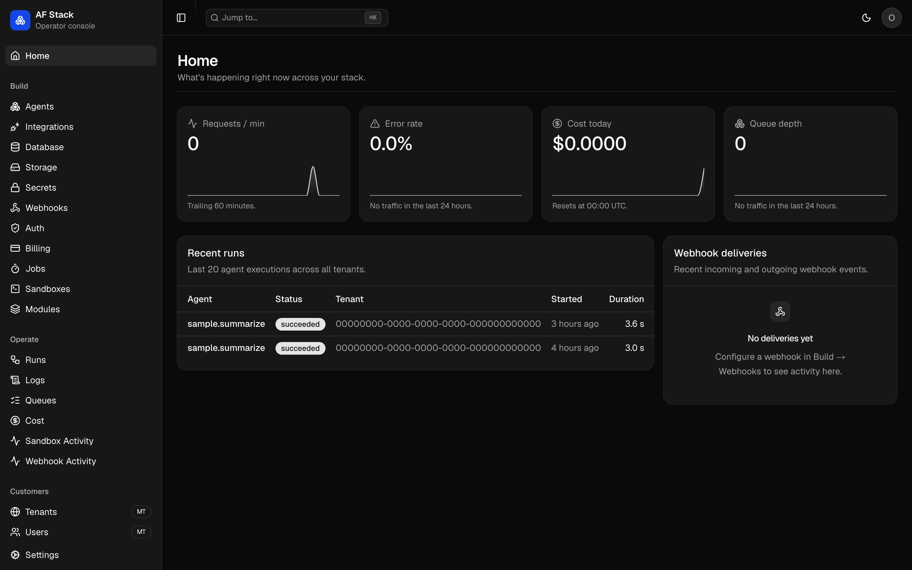
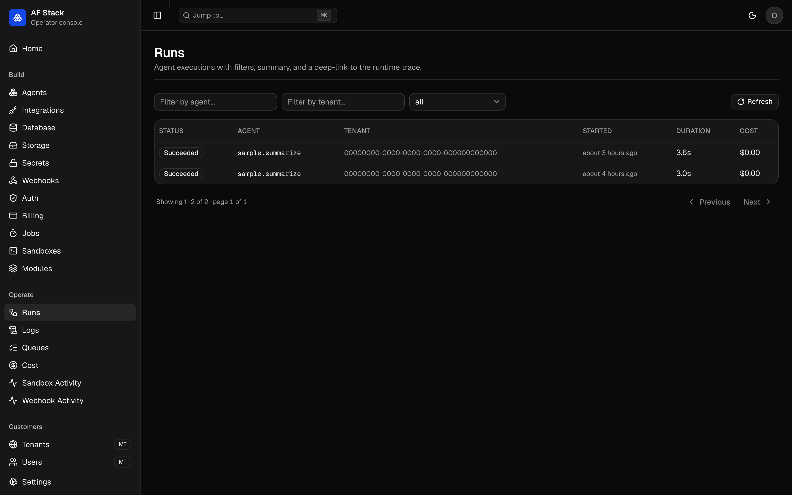
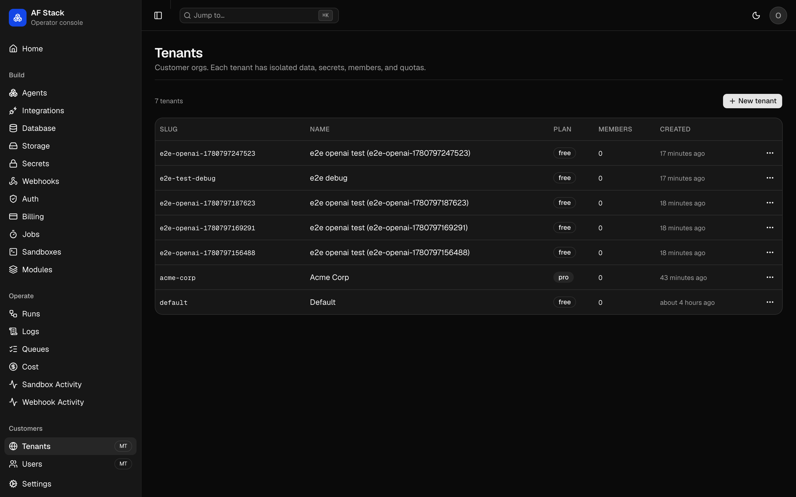
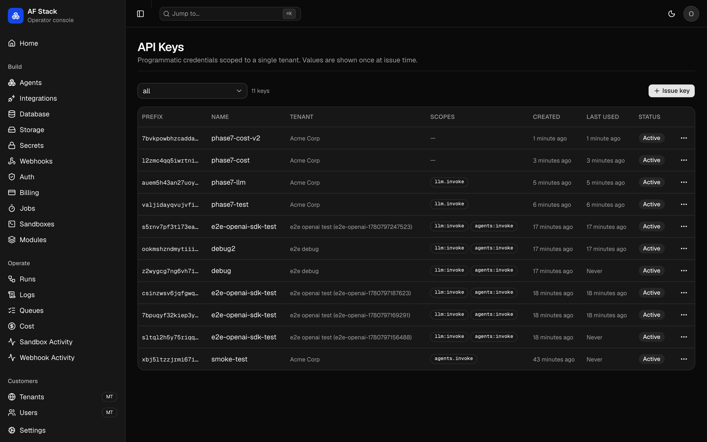

<div align="center">

# AF Stack

### The open backend platform for the AI era.

*Self-host AgentField with everything else you need to ship a real product.*

[](#)
[](LICENSE)
[](https://github.com/Agent-Field/agentfield)

</div>

> **Working name**. The brand is being decided. See [`BRAND.yaml`](BRAND.yaml).

## What this is

A single fork-friendly monorepo that bundles **AgentField** with everything
around it: identity, multi-tenancy, sandboxes, storage, queues, public
APIs, billing, dashboard. Clone the repo. Customize. Deploy.

Not a hosted service. Not a closed SDK. Not a framework. **A complete,
self-hostable backend platform where AI is a native compute primitive.**

## Why

Building an AI-native product today means assembling 10+ services: auth,
db, storage, queue, gateway, agent runtime, sandboxes, webhooks, billing,
observability. Each integration costs weeks. Each vendor adds lock-in.

Supabase-shaped backends don't include AI primitives. AI platforms don't
include backend primitives. Builders rebuild the same plumbing for every
project.

AF Stack ships both halves. AgentField for agents. Postgres + Next.js +
the suite runtime for everything else.

## The invariant

**Every LLM call goes through AgentField.** No bypass. The
OpenAI-compatible endpoint at `/api/v1/llm/*` is a shim that routes
through AF so identity, traces, cost, policy, and audit are preserved.

## Two SDKs, clear boundary

> **`app.*` defines agents. `suite.*` calls them and runs everything else.**

| SDK | Use inside |
|---|---|
| **AgentField** (`app.*`) | Agent processes |
| **Suite** (`suite.*`) | App handlers, jobs, dashboard — anywhere outside an agent |

Plus a REST + OpenAPI surface so any language works.

## The operator console

<div align="center">



<sub>Home: requests/min · error rate · cost today · queue depth · live runs</sub>



<sub>Operate → Runs: filter by agent / tenant / status, link out to full trace</sub>


<sub>Operate → Cost: spend by model · agent · tenant · day, with budgets and forecast</sub>


<sub>Customers → Tenants: per-customer drilldown with usage, members, audit</sub>


<sub>Customers → API Keys: issue / rotate / revoke with one-time-reveal</sub>

</div>

## Quickstart (under 60 seconds)

```bash
git clone https://github.com/Agent-Field/backai my-app
cd my-app
cp .env.example .env
# (optional) edit .env: set OPENROUTER_API_KEY to enable LLM features
docker compose up
```

Then in another terminal, call the bundled sample agent through the
gateway:

```bash
curl -X POST http://localhost:8080/api/v1/agents/sample.echo \
  -H "Content-Type: application/json" \
  -d '{"input":{"payload":{"message":"hello world"}}}'
# → {"status":"succeeded","result":{"echoed":{"message":"hello world"}}, ...}
```

Endpoints once up:

- Suite gateway: `http://localhost:8080/api/v1/`
- Health + metrics: `http://localhost:8080/health` · `/ready` · `/metrics`
- AgentField control plane: `http://localhost:8081/`
- MinIO console: `http://localhost:9001/`

Dashboard (Next.js) lands in Phase 3.

To enable multi-tenancy: set `modules.multi-tenancy.enabled: true` in
`apps/backend/config.yaml`. See [`docs/multi-tenancy.md`](docs/multi-tenancy.md)
for the full guide, including how to run the end-to-end isolation test
(`scripts/test-multi-tenancy.sh`).

## Phase 7 — LLM Gateway

Every LLM call in the suite goes through the gateway at `/api/v1/llm/*`.
The wire shape is OpenAI-compatible, so any OpenAI-shaped client works
by changing one line: the base URL.

<div align="center">

<sub>Operate → Cost: live cost events, model mix, per-tenant spend, budget meters</sub>
</div>

**One-line OpenAI SDK config** (works with the official `openai` package
on every language):

```js
import OpenAI from "openai"

const client = new OpenAI({
  baseURL: "http://localhost:8080/api/v1/llm",
  apiKey: process.env.AF_STACK_TENANT_KEY,
})

const completion = await client.chat.completions.create({
  model: "qwen/qwen-2.5-72b-instruct",
  messages: [{ role: "user", content: "Hello!" }],
})
```

**Or use the Suite SDK** — same gateway, ergonomic helpers, typed
responses, plus access to the cost log and budgets:

```python
from af_stack import suite

# Chat — non-streaming
response = await suite.llm.chat(
    model="qwen/qwen-2.5-72b-instruct",
    messages=[{"role": "user", "content": "Hello!"}],
)
print(response["choices"][0]["message"]["content"])

# Chat — streaming
async for chunk in await suite.llm.chat(
    model="qwen/qwen-2.5-72b-instruct",
    messages=[{"role": "user", "content": "Tell me a story."}],
    stream=True,
):
    delta = chunk["choices"][0]["delta"].get("content", "")
    print(delta, end="", flush=True)

# Cost log + budgets
events = await suite.cost.events(tenant="acme", limit=20)
await suite.admin.budgets.set({
    "tenant_id": "acme",
    "monthly_usd": 500,
    "alert_threshold_pct": 80,
})
```

Every call is recorded with tenant, agent, model, tokens, cost, and
cache-hit flag. Budgets are per-tenant; when a tenant exceeds its
monthly cap, subsequent calls fail with `HTTP 402 BUDGET_EXCEEDED`.

End-to-end tests:

```bash
# Real openai npm package against a live runtime
node scripts/test-openai-sdk.mjs

# Budget enforcement (creates tiny budget, verifies 402 on overrun)
./scripts/test-budget-enforcement.sh
```

### Make it your own

Replace the sample agent with your own at `apps/backend/agents/<name>/` —
each subfolder is its own container that registers with AgentField on
startup. Edit `apps/backend/config.yaml` to enable / disable suite
modules. Customize as you like; everything in this repo is yours after
the fork.

## Status

This is being built in the open. See [`ROADMAP.md`](ROADMAP.md) for the
phased build plan and [GitHub Issues](https://github.com/Agent-Field/backai/issues)
for what's in flight.

| Phase | What | Status |
|---|---|---|
| 0 | Foundations | in progress |
| 1 | Runtime + AF wiring | |
| 2 | First end-to-end + 60s quickstart | |
| 3 | Identity + dashboard shell | |
| 4 | Hero — Agent Runs | |
| 5 | Jobs + secrets + storage | |
| 6 | Multi-tenancy + gateway | |
| 7 | Hero — LLM Gateway | |
| 8 | Hero — DB studio + memory | |
| 9 | Hero — Sandboxes | |
| 10 | Notifications + webhooks + billing | |
| 11 | MCP + skills + harnesses | |
| 12 | Hero — Tenants + remaining tabs | |
| 13 | Examples + workload modules | |
| 14 | Deploy + production hardening | |
| 15 | Documentation + polish | |
| 16 | Security audit + launch | |

## Documentation

Architecture and product docs live in this repo:

- [`PRD.md`](PRD.md) — Product Requirements Document
- [`TECH-SPEC.md`](TECH-SPEC.md) — Technical specification
- [`ROADMAP.md`](ROADMAP.md) — Phased build plan
- [`PLAN.md`](PLAN.md) — Architectural plan (full)
- [`docs/`](docs/) — Validation walkthroughs, SDK strategy, AF analysis

## Built on AgentField

AgentField is the agent runtime at the core of AF Stack. AgentField
provides agents, the LLM gateway, memory, traces, MCP integration via
harnesses, verifiable credentials, and cryptographic identity. AF Stack
adds the production wrapping around it.

[AgentField repo →](https://github.com/Agent-Field/agentfield)

## License

Apache 2.0. See [`LICENSE`](LICENSE).

## Contributing

Read [`CONTRIBUTING.md`](CONTRIBUTING.md). Issues and PRs welcome.
