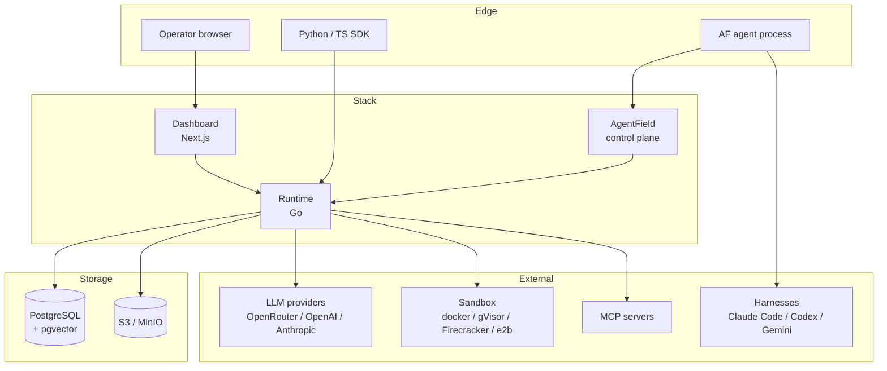

AF Stack is three processes (runtime, dashboard, AgentField control
plane) talking to Postgres and an object store. Everything else —
LLM providers, sandboxes, harnesses, MCP servers — sits behind
adapter interfaces and is interchangeable.

## System diagram

## Process responsibilities

| Process | Owns | Doesn't own |
|---|---|---|
| **Runtime (Go)** | HTTP API, modules, adapters, scheduler, workers, OpenAPI, cost ledger | Agent logic, UI rendering, LLM provider state |
| **Dashboard (Next.js)** | Operator UI, better-auth sessions, plugin discovery, theming | Tenant data (read through runtime), durable storage |
| **AgentField control plane** | Agent registration + lifecycle, node discovery | Modules, tenancy, billing |

## Request lifecycle

When the operator opens the cost tab:

1. Browser hits `GET /operate/cost` on the dashboard.
2. Dashboard's server component calls `api.cost()` which hits
   `GET /api/v1/cost` on its own origin.
3. The dashboard's same-origin proxy at
   `apps/dashboard/src/app/api/v1/[...path]/route.ts` forwards the
   request to `RUNTIME_URL` with the operator's session cookie attached.
4. Runtime's `tenant_resolver` middleware reads the cookie, looks up
   the session in `session` (better-auth), joins to `suite_users` by
   email, finds the user's tenant via `suite_memberships`.
5. The cost handler queries `suite_cost_events` filtered by the
   resolved tenant (or aggregated across tenants when MT is off).
6. Response goes back through the proxy and gets rendered server-side.

That's ~30ms end-to-end on a warm system. The same path holds for every
endpoint — tenant resolution is uniform.

When an SDK makes an LLM call:

1. `client.chat.completions.create(...)` POSTs to
   `/api/v1/llm/chat/completions` with `Authorization: Bearer af_...`.
2. Tenant resolver looks up the API key via `suite_api_keys`, attaches
   the tenant + API key id to context.
3. LLM gateway looks up the model in the pricing catalog, routes to
   the chosen provider (env-determined order), forwards the request.
4. Provider response streams back. The gateway fires
   `HookLLMPostCall` with prompt + completion tokens.
5. The cost recorder (a hook handler) writes a row to
   `suite_cost_events` with the calculated USD cost.
6. The response returns to the SDK.

## Composite reasoning

AF Stack inherits the architectural premise from
[`code/CLAUDE.md`](https://github.com/Agent-Field/backai/blob/main/code/CLAUDE.md):
**intelligence is in composition, not in components**. Individual LLMs
score ~0.3 — 0.4 on a normalised reasoning scale. Composed harnesses
score 0.7 — 0.8 for specific problem domains.

Three primitives:

### `.harness()` — the atomic unit of intelligence

A stateful, multi-turn, tool-using agent. The orchestrator hands it a
goal and verifies the outcome — it doesn't control each step. Examples:
Claude Code reading + editing a codebase, a research harness exploring a
question, an SWE harness coding a feature.

Use `.harness()` when:
- The input is large (> 3000 tokens).
- The work needs navigation / tool use.
- The output is rich (narrative findings, multi-field schemas).

### `.ai()` — fast structured classification

Single-shot, no tools, no state, flat Pydantic schema out. Examples:
intake classification, routing gates, coverage checks.

Use `.ai()` when:
- The input fits comfortably in one context window (< 2000 tokens).
- The decision is bounded (enum, small object).
- Speed matters more than depth.

### Inter-agent data flow

Structured JSON between code-driven routing. Strings between
LLM-to-LLM hops. Hybrid for both. The
[multi-reasoner-archei-rules.md](https://github.com/Agent-Field/backai/blob/main/code/multi-reasoner-archei-rules.md)
companion document enumerates the trade-offs.

## Where the patterns show up in af-stack

| Pattern | Used by | Where in code |
|---|---|---|
| `.harness()` | Sandbox runs, MCP tool calls, deep-research example | `services/runtime/internal/sandbox/`, `mcp/`, `examples/06-deep-research/` |
| `.ai()` | Notable's suggest_tags agent, cost forecasting | `examples/01-notable/agents/suggest_tags/` |
| HUNT → PROVE adversarial | Not yet in the platform — see `code/examples/sec-af/` | — |
| Fan-out → filter → gap-find | Deep research example | `examples/06-deep-research/agents/researcher/` |
| Reactive enrichment | Webhook handlers (Phase 10) | `services/runtime/internal/webhooks/inbound.go` |

## Persistence

Two systems hold state:

- **Postgres** (with pgvector): everything operational. Tenants, keys,
  costs, jobs, crons, secrets, memory entries, notifications, webhooks,
  sandbox runs, billing customers, usage meters.
- **Object storage** (MinIO or S3): blobs only. Sandbox stdout/stderr,
  webhook delivery payloads, workload-module attachments.

Row-level security is enforced at the Postgres boundary keyed on a per-
session GUC (`app.tenant_id`). The runtime sets the GUC at the start of
every transaction, so even a buggy handler can't leak across tenants.

## Modules and adapters

Every external dependency is an adapter behind a Go interface. New
provider, new adapter package, register at boot, done. Examples:

- LLM providers — `services/runtime/internal/llmgateway/providers/`
- Sandbox runtimes — `services/runtime/internal/sandbox/adapters/`
- Notification delivery — `services/runtime/internal/notifications/adapters/`
- Storage backends — `services/runtime/internal/storage/adapters/`

Modules are larger feature surfaces (multi-tenancy, billing, MCP,
skills) that own their own tables, REST endpoints, and dashboard
sections. The module reference lists every one.

## Observability

- `/api/v1/metrics/summary` — at-a-glance Prometheus rollup the
  dashboard renders. Top-10 routes, p95 latency, goroutines, heap.
- `/metrics` (Prometheus format) — full surface for an external scraper.
- `/api/v1/logs` — in-process slog ring, last N entries. The dashboard's
  Logs tab reads from this; production deploys ship logs to a real
  collector via the existing slog handler.
- OpenTelemetry traces — set `OTEL_EXPORTER_OTLP_ENDPOINT` and traces
  flow to your collector. Spans cover every handler + every LLM call.

## What AF Stack is not

- Not a vector database (it embeds pgvector but doesn't claim to replace
  Pinecone / Weaviate at scale).
- Not a workflow engine (it has a job queue, not Temporal).
- Not an AI gateway (Portkey / Helicone are gateways; AF Stack is a
  whole backend that contains a gateway).
- Not opinionated about agent frameworks. It hosts agents written
  against AgentField, but the gateway is provider-shaped (OpenAI
  compatible) so anything that speaks that surface works.

## Next

- [Quickstart](/get-started/quickstart/) — get hands-on.
- [Reference → Modules](/reference/modules/) — what each module does.
- [Reference → Adapters](/reference/adapters/) — what each adapter
  does.
- [Examples](https://github.com/Agent-Field/backai/tree/main/examples)
  — see it composed end-to-end.
