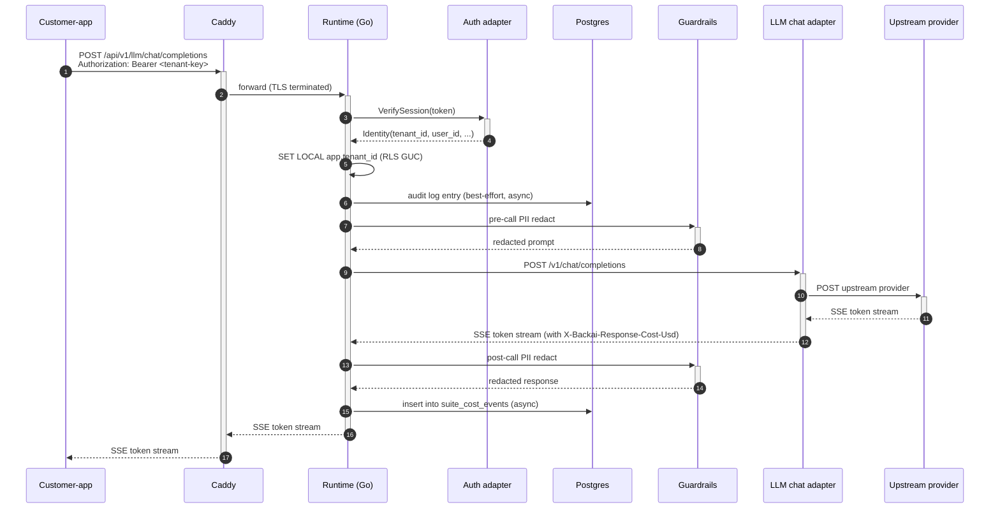
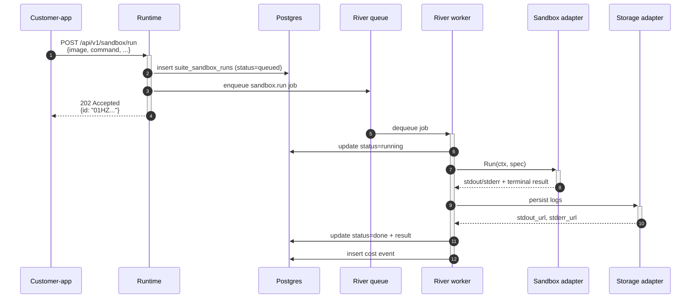
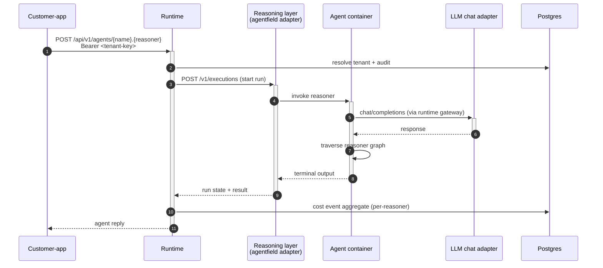

# BackAI — Architecture (for internal developers)

> Read this before you make architectural decisions. After one careful
> pass you should understand how requests flow, where every subsystem
> lives, how multi-tenancy works, and how to add an adapter, a workload
> module, or a dashboard plugin.

---

## 1. What BackAI is

BackAI is an opinionated, fork-friendly **AI app template**. One git
repository that an indie hacker can clone and have a working AI SaaS —
customer app, operator dashboard, runtime gateway, tenancy, cost
ledger, LLM routing, sandboxes, agents, storage, billing, webhooks —
running with `docker compose up`.

The platform is built around a **single Go runtime** that mediates
every external concern through a **small set of typed Go interfaces**,
each with one or more interchangeable **adapter implementations**.
Some adapters are in-tree (`docker`, `stripe`, `minio`); others can be
third-party sidecar processes speaking the documented HTTP protocol.

The dashboard and customer-app are Next.js applications. They never
talk to upstream OSS directly — always through the runtime.

---

## 2. The 8 bands

```
┌─────────────────────────────────────────────────────────────────────┐
│ ① CLIENT                                                            │
│   Operator dashboard (Next.js)   Customer app (Next.js)             │
│   SDKs: Go · TypeScript · Python                                    │
└─────────────────────────────────┬───────────────────────────────────┘
                                  │ HTTPS
┌─────────────────────────────────▼───────────────────────────────────┐
│ ② EDGE                                                              │
│   Caddy — TLS termination, reverse proxy, auto-renew                │
└─────────────────────────────────┬───────────────────────────────────┘
                                  │
┌─────────────────────────────────▼───────────────────────────────────┐
│ ③ API GATEWAY                                                       │
│   Runtime (Go) — services/runtime/cmd/af-stack                      │
│   ├─ HTTP routing + OpenAPI 3.1                                     │
│   ├─ Auth adapter (better-auth / Clerk / WorkOS / remote)           │
│   ├─ Postgres RLS via session GUC                                   │
│   ├─ Audit log                                                      │
│   └─ Secrets vault (envelope-encrypted, KMS-backed)                 │
└────┬────────────┬────────────────┬───────────────────┬──────────────┘
     │            │                │                   │
┌────▼────┐  ┌────▼─────┐  ┌───────▼─────┐  ┌──────────▼────────────┐
│ ④ REASON│  │ ⑤ EXEC   │  │ ⑥ DELIVERY  │  │ ⑦ OBSERVABILITY       │
│ -ING    │  │ Sandboxes│  │ Svix        │  │ OpenTelemetry         │
│ agent-  │  │  ·docker │  │ Resend      │  │ Prometheus            │
│  field  │  │  ·gvisor │  │ Stripe/Lago │  │ slog                  │
│ LLM     │  │  ·e2b    │  │             │  │                       │
│ chat    │  │ River    │  │             │  │                       │
│ Multi   │  │          │  │             │  │                       │
│ -modal  │  │          │  │             │  │                       │
│ MCP     │  │          │  │             │  │                       │
└────┬────┘  └─────┬────┘  └──────┬──────┘  └──────────┬────────────┘
     │            │                │                   │
     └────────────┴───────┬────────┴───────────────────┘
                          │
┌─────────────────────────▼───────────────────────────────────────────┐
│ ⑧ DATA                                                              │
│   Postgres 16 + pgvector  (relational · vector · queue · FTS · RLS) │
│   MinIO / S3              (object storage)                          │
│   Redis 7                 (Svix-private cache only)                 │
└─────────────────────────────────────────────────────────────────────┘
```

**Why this shape:** mirrors Supabase / Plane / Cal.com with two
differences — Intelligence (Reasoning) is a peer band (not bolted on),
and Postgres is even more load-bearing (relational + vector + queue +
FTS + audit on one image).

---

## 3. Repository layout

```
backai/
├── services/
│   └── runtime/                # the Go runtime — ONE binary
│       ├── cmd/
│       │   ├── af-stack/       # main()
│       │   └── backai-adapter-conformance/   # adapter validator
│       └── internal/
│           ├── server/         # HTTP routes + middleware
│           ├── tenancy/        # tenant resolver + GUC binding
│           ├── audit/          # mutation log
│           ├── auth/                            # auth adapter slot
│           │   └── adapters/remote/
│           ├── secrets/        # vault + Store interface
│           │   └── adapters/remote/
│           ├── llmgateway/     # OpenAI-compat chat gateway
│           │   ├── providers/remote/            # chat remote shim
│           │   └── adapters/
│           │       ├── litellm/  elevenlabs/  cartesia/  fal/  flux/
│           │       └── remote/   # multimodal remote shim
│           ├── sandbox/        # code-execution
│           │   └── adapters/
│           │       ├── docker/  e2b/  firecracker/  gvisor/
│           │       └── remote/
│           ├── storage/        # object storage
│           │   └── adapters/
│           │       ├── minio/  s3/
│           │       └── remote/
│           ├── notifications/  # email/sms/slack/log
│           │   └── adapters/
│           │       ├── log/  resend/
│           │       └── remote/
│           ├── billing/        # stripe / lago
│           │   └── adapters/remote/
│           ├── adapters/
│           │   ├── remote/     # SHARED HTTP client used by every remote shim
│           │   └── registry/   # adapter inventory + /admin/adapters
│           ├── agentfield/  jobs/  webhooks/  crons/  approvals/
│           ├── memory/  search/  cost/  activity/  feature flags/
│           ├── mcp/  tools/  guardrails/  observability/
│           ├── harnesses/  shipwright/
│           └── db/  config/  rbac/  oauth/  ...
├── apps/
│   ├── dashboard/              # operator console (Next.js)
│   ├── customer-app/           # default DocChat fork
│   └── backend/agents/         # Python AgentField agents
├── workload-modules/<id>/      # operator-added backend modules
├── docs/
│   ├── ARCHITECTURE.md         # this file
│   ├── dashboard/spec-v1.md    # operator console IA spec
│   └── adapters/
│       ├── PROTOCOL.md         # universal adapter contract
│       ├── AUTHORING.md        # how to write your own
│       ├── CONFORMANCE.md      # how to test yours
│       ├── README.md           # adapter index
│       └── protocols/          # per-slot specs (8 slots)
│           ├── sandbox-v1.md  storage-v1.md  notifications-v1.md
│           ├── secrets-v1.md  billing-v1.md  multimodal-v1.md
│           ├── llm-chat-v1.md  auth-v1.md
└── examples/
    └── adapters/
        └── sandbox-echo-py/    # reference Python adapter
```

---

## 4. The adapter system — the modularity spine

This is the most important section.

### 4.1 The four tiers

Not every subsystem is hot-swappable. We classify by tier so the
architecture is honest:

| Tier | Meaning | Examples | Swap by |
|---|---|---|---|
| **1** | Hot-swappable: real Go interface + multiple implementations or remote-adapter pattern | Sandbox, object storage, notifications, billing, multimodal LLM, LLM chat gateway, auth, secrets. **Plus 4 observability slots (logs, traces, metrics, errors) when the `observability` compose profile is active.** | Setting `AF_STACK_<slot>_ADAPTER=...` (or starting the observability profile) and restarting |
| **2** | Config-swappable: same wire protocol | Postgres (Aurora, Neon, RDS, Supabase, self-hosted) | Changing `DATABASE_URL` |
| **3** | Interface-swappable: Go interface exists, only one impl today | Job queue, outbound webhooks, reasoning | Writing the second adapter |
| **4** | Foundational: tightly coupled to platform's core abstractions | Postgres RLS pattern, pgvector | Fork the codebase |

> **Observability slots roadmap** — `logs` (Loki+Vector default), `traces` (Tempo via otel-collector default), `metrics` (Prometheus + cAdvisor default), `errors` (GlitchTip default). All four are scoped in `development/backend-admin-contract-audit-v1.md`; they ship as Tier-1 once the observability compose profile is built.

Tier matters for the dashboard: `Setup → Adapters` renders each slot
with the affordances appropriate to its tier.

### 4.2 The Tier-1 slots (8 of them)

Each defines a small Go interface in
`services/runtime/internal/<slot>/`. Listed with their core verbs:

| Slot | Go interface | Built-in adapters | Remote shim |
|---|---|---|---|
| `sandbox` | `sandbox.Sandbox` (Run, Stream, Stop, Capabilities) | docker, gvisor, firecracker, e2b | ✓ |
| `storage` | `storage.Storage` (Upload, Download, SignedURL, Delete, List, EnsureBucket, Capabilities) | minio, s3 | ✓ |
| `notifications` | `notifications.Adapter` (Send, Name) | log, resend | ✓ |
| `secrets` | `secrets.Store` (Get, GetMetadata, Put, Delete, List, Rotate) | envelope-local | ✓ |
| `billing` | `billing.Client` (CreateCustomer, GetCustomer, CreatePortalLink, VerifyWebhook, AdapterName, IsStub) | stripe, lago | ✓ |
| `multimodal` | `MultimodalAdapter` (Speech, Transcribe, Image, HandlesModel, supports flags, Name) | litellm, elevenlabs, cartesia, fal, flux | ✓ |
| **`llm-chat`** | `llmgateway.Provider` (Chat, ChatStream, Embeddings, Name) | LiteLLMProvider | ✓ |
| **`auth`** | `auth.Provider` (VerifySession, RefreshSession, RevokeSession, GetUser, Capabilities) | better-auth (via runtime tenancy) | ✓ |

### 4.3 The remote-adapter pattern (HTTP sidecar)

For every Tier-1 slot we ship a **remote-adapter shim** under
`services/runtime/internal/<slot>/adapters/remote/` (or
`providers/remote/` for llm-chat). The shim satisfies the Go interface
by speaking the per-slot HTTP protocol to a sidecar process.

```
Runtime (Go)                       Sidecar (any language)
─────────────                      ─────────────────────
sandbox.Sandbox                    /v1/runs
  ↓                                /v1/runs/stream  (SSE)
remote.Adapter ─────HTTP/JSON────► /v1/runs/{id}
  ↓                                /v1/capabilities
remote.Client                      /healthz
```

Activation:

```bash
AF_STACK_SANDBOX_ADAPTER=remote
AF_STACK_SANDBOX_ADAPTER_URL=http://my-sidecar:8090
AF_STACK_SANDBOX_ADAPTER_TOKEN=<bearer>
```

A third-party startup writes the sidecar in any language, ships a
container image, tells operators to set the env vars. **No BackAI
runtime code change required.**

### 4.4 The shared remote envelope

All remote shims use one shared Go package:

`services/runtime/internal/adapters/remote/`

It provides: authenticated HTTP client with connection pooling,
typed RFC 7807 errors, SSE event parser, idempotency-key
auto-generation for writes, retry with jittered backoff on 5xx + 429 +
transient network, capability cache, context cancellation propagation
end-to-end, no-buffering streaming for large bodies.

Per-slot shims (~150–250 lines each) take the interface's typed input,
map to JSON wire shape, call `client.Do(ctx, remote.Request{...})`,
decode the response back to the interface's typed output. Protocol is
the source of truth; protocol changes cascade to one place per slot.

### 4.5 Capability declaration

Every adapter (in-tree or remote) declares its capabilities. Remote:
`GET /v1/capabilities` returns the envelope. In-tree: a `Capabilities()`
Go method returns the same shape.

### 4.6 The registry and `/api/v1/admin/adapters`

`services/runtime/internal/adapters/registry/` collects every wired
slot at boot. The dashboard fetches `GET /api/v1/admin/adapters` to
populate the **Setup → Adapters** page:

```json
{
  "slots": [
    {
      "slot": "sandbox",
      "tier": 1,
      "active": {
        "name": "docker",
        "version": "26.0",
        "status": "healthy",
        "kind": "builtin",
        "capabilities": { "supports_gpu": false, "max_timeout_s": 86400 }
      },
      "available_builtin": ["docker", "gvisor", "firecracker", "e2b"],
      "swap_method": "env_var",
      "swap_env": "AF_STACK_SANDBOX_ADAPTER",
      "admin_ui": null
    }
  ]
}
```

The registry refreshes adapter status via `/healthz` probes on a 30s
TTL.

---

## 5. Request lifecycle

### 5.1 Chat completion (the common case)



**Critical contract:** every LLM call goes through `/api/v1/llm/*`. No
bypass. This is what guarantees per-tenant cost, audit, and budget
enforcement.

### 5.2 Async sandbox run



### 5.3 Agent invocation (reasoning layer)



---

## 6. Multi-tenancy model

Every customer of the operator is a **tenant**. Five isolation
dimensions:

| Dimension | Mechanism |
|---|---|
| Authorization | Per-tenant API keys minted from `Customers → API keys`. Map to LiteLLM virtual keys for upstream rate-limit + budget. |
| Data | Postgres Row-Level Security. Tenant resolver sets `app.tenant_id` GUC; every table policy is `using (tenant_id = current_setting('app.tenant_id'))`. |
| Cost | Cost ledger writes tenant_id on every row. Budgets per-tenant. Runtime returns HTTP 402 when a tenant exceeds its cap. |
| Memory / storage | Memory entries and storage keys are tenant-prefixed. |
| Audit | Every mutation records actor + tenant. |

The customer-app maps one signup → one tenant. The backend supports
team mode (1 tenant + N members via `suite_memberships`) but the
default DocChat customer-app uses solo mode.

**The customer never sees the word "tenant".** That's the operator's
vocabulary in the dashboard.

---

## 7. Data architecture

Postgres is the substrate. One database (`afstack`) holds:

- **Relational tables** — tenants, users, memberships, api keys, runs, cost events, audit log, secrets, modules, ...
- **Vector embeddings** via `pgvector` — `suite_memory_vectors`
- **Job queue** via River — `river_job`, `river_queue`
- **Full-text search** — `tsvector` + GIN indexes
- **RLS policies** on every tenant-scoped table

A separate database (`agentfield`) holds AgentField's own run state.

Migrations live in `services/runtime/internal/db/migrations/` and run
on startup via `pressly/goose`.

---

## 8. Concurrency model

Three sources of concurrency:

1. **HTTP serving** — `net/http` standard server, one goroutine per request. Middleware: CORS → logging → auth → tenancy → handler.
2. **River workers** — async background work; bounded concurrency per kind.
3. **Streaming** — LLM responses, sandbox log tails, run subscriptions. Goroutines fed via channels, closing on context cancellation.

The remote-adapter `Client` uses one shared `*http.Transport` per
adapter URL (connection pooling) and respects `ctx` cancellation
end-to-end.

---

## 9. Deployment topology

### 9.1 Local development

`docker compose up` brings up:

```
postgres        litellm        agentfield      runtime
minio           svix-server    svix-postgres   svix-redis
dashboard       customer-app   supportdesk-agent
```

Remote-adapter sidecars (operator-supplied) extend compose via
`docker-compose.override.yml`.

### 9.2 Production

Deploy targets: `deploy/{railway,fly,render,helm,nomad}/`. Tier-2
swaps (managed Postgres, S3) via env: `DATABASE_URL`, `AF_STACK_S3_ADAPTER=s3`.

---

## 10. How to add things

### 10.1 A new agent

Drop a directory under `apps/backend/agents/<name>/` with a Python
Dockerfile that registers with AgentField on startup.

### 10.2 A new built-in adapter (e.g., swap MinIO for a custom S3 fork)

1. Implement the slot's interface (`storage.Storage`) in `services/runtime/internal/storage/adapters/<your-name>/`.
2. Wire the factory branch in `services/runtime/cmd/af-stack/main.go`.
3. Set `AF_STACK_S3_ADAPTER=<your-name>` and restart.

### 10.3 A new remote adapter (recommended for third parties)

1. Read `docs/adapters/PROTOCOL.md` + `docs/adapters/protocols/<slot>-v1.md`.
2. Implement the HTTP protocol in any language. Reference: `examples/adapters/sandbox-echo-py/`.
3. Run the conformance harness: `backai-adapter-conformance --slot <slot> --url http://localhost:PORT`.
4. Operator: `AF_STACK_<SLOT>_ADAPTER=remote` + `AF_STACK_<SLOT>_ADAPTER_URL=http://your-sidecar:port`. Restart.

The runtime calls `GET /v1/capabilities` + `GET /healthz` at boot; the
dashboard shows the adapter under `Setup → Adapters` with declared
capabilities.

### 10.4 A new workload module

Drop a directory under `workload-modules/<id>/`:

```
manifest.yaml         # routes, migrations, jobs, crons
handler.go            # Go HTTP handlers
migrations/*.sql      # schema additions
```

The runtime's module loader mounts your routes at `/workload/<id>/...`
on next start.

### 10.5 A new dashboard plugin

Drop a directory under `apps/dashboard/plugins/<id>/`:

```
plugin.yaml           # parent_group, sidebar label/icon, route
page.tsx              # the React component
```

The dashboard's build picks it up on next build.

---

## 11. Testing strategy

Three layers:

### 11.1 Unit + integration tests

Per-package `_test.go` files using `httptest.NewServer` to mock
external services. Run with `go test ./...`. Every remote shim has
its own test suite (112+ tests across the adapter packages today).

### 11.2 End-to-end tests

Actually launch real services and exercise a full flow.

- **Sandbox E2E** — runs the reference Python adapter as a child process, hits it through the Go shim.
- **LLM E2E** — calls real OpenRouter (Kimi) through both the bare HTTP path AND the llm-chat remote shim via an httptest-hosted "OpenRouter proxy".

Build tag: `e2e`. Run with `go test -tags=e2e ./services/runtime/...`.

### 11.3 Conformance harness

`backai-adapter-conformance` is a standalone Go binary third parties
run against their own adapter to verify protocol conformance.

```bash
backai-adapter-conformance --slot sandbox --url http://localhost:8090
```

Supported slots: sandbox, storage, notifications, secrets, billing,
multimodal, llm-chat, auth.

---

## 12. Pitfalls and contracts

1. **All remote shims share `services/runtime/internal/adapters/remote/`.** Don't write a parallel HTTP client.
2. **Protocol JSON is `snake_case`.** Don't drift.
3. **Idempotency keys are required for writes.** Shared client auto-generates one.
4. **Capability fetch on `New()` fails fast.** Better than failing in production.
5. **`var _ Iface = (*Impl)(nil)` everywhere.** Compile-time interface checks.
6. **Streaming bodies never buffered.** `io.Reader` in, `io.ReadCloser` out.
7. **`ctx.Done()` is the leash on every goroutine.**
8. **Multi-tenancy is enforced by Postgres RLS**, not application code.
9. **Costs recorded async (best-effort).** Never block user requests.
10. **Secrets never in logs.** Use `secrets.RedactedMarker`.

---

## 13. Versioning

- Protocol versions: `/v1`, breaking changes go to `/v2`.
- Runtime versions: semver. Sent on every adapter call via `X-Backai-Runtime-Version`.
- Adapter versions: each adapter sets `version` in capabilities envelope.

Adding optional fields: not breaking. Removing fields: breaking. Tightening validation: breaking.

---

## 14. Glossary

- **Operator** — the developer who forked BackAI and runs the platform.
- **Tenant** — one of the operator's customers (a workspace / org).
- **Member** — a human user inside a tenant.
- **Slot** — an adapter-backed subsystem (sandbox, storage, ...).
- **Adapter** — one implementation of a slot's interface.
- **Remote shim** — Go code that satisfies a slot interface via HTTP to a sidecar.
- **Sidecar** — separate process (any language) implementing the per-slot HTTP protocol.
- **Workload module** — operator-added backend code mounted at `/workload/<id>/...`.
- **Plugin** — operator-added dashboard tab.
- **Reasoner** — one step in an agent's directed graph.
- **Capability** — a flag/limit an adapter declares so the UI/runtime can adapt.

---

## 15. Where to start when onboarding

1. `README.md` — elevator pitch + quickstart.
2. This file (you're here).
3. `docs/adapters/PROTOCOL.md` — the modular contract.
4. `services/runtime/cmd/af-stack/main.go` — how everything is wired.
5. `services/runtime/internal/server/server.go` — the routing table.
6. Pick one slot — read its interface, one in-tree adapter, and the
   `adapters/remote/` shim. That's the pattern that repeats.

Welcome.
