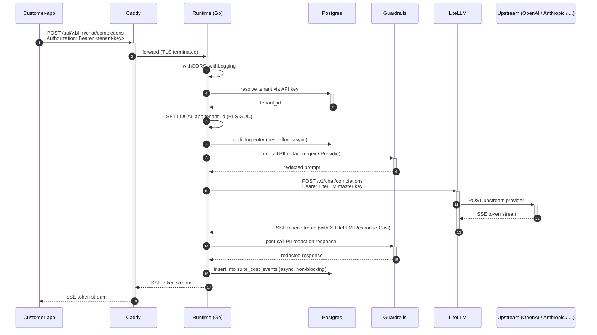
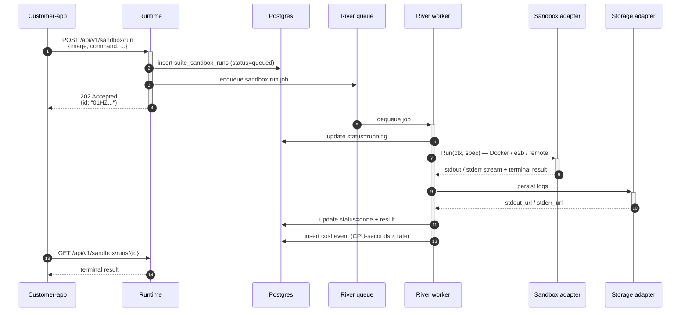
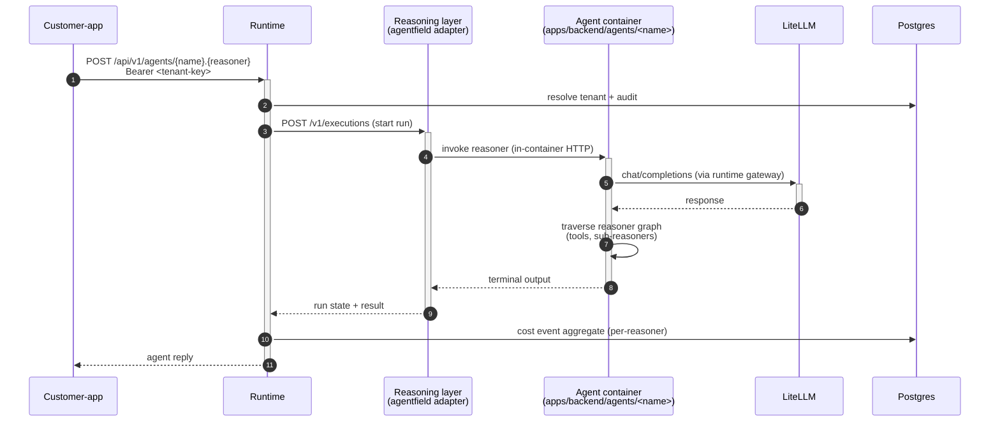

# BackAI — Architecture (for internal developers)

> Read this before you make architectural decisions. The intent is that
> after one careful pass you understand how requests flow, where every
> subsystem lives, how multi-tenancy works, and how to add an adapter,
> a workload module, or a dashboard plugin.

---

## 1. What BackAI is

BackAI is an opinionated, fork-friendly **AI app template**. It is one
git repository that an indie hacker can clone and have a working AI
SaaS — customer-facing app, operator dashboard, runtime gateway,
tenancy, cost ledger, LLM routing, sandboxes, agents, storage, billing,
webhooks — running with `docker compose up`.

The platform is built around a **single Go runtime** that mediates
every external concern (auth, tenancy, LLM calls, sandbox execution,
storage, notifications, billing, agents) through a **small set of
typed Go interfaces**, each of which has one or more interchangeable
**adapter implementations**. Some adapters are in-tree (`docker`,
`stripe`, `minio`); others can be supplied by a third party as a
sidecar process speaking the documented HTTP protocol.

The dashboard and customer-app are Next.js applications. They never
talk to upstream OSS directly — they always go through the runtime.

---

## 2. The 8 bands

```
┌─────────────────────────────────────────────────────────────────────┐
│ ① CLIENT                                                            │
│   Operator dashboard (Next.js)   Customer app (Next.js)             │
│   SDKs: Go · TypeScript · Python                                    │
└─────────────────────────────────┬───────────────────────────────────┘
                                  │ HTTPS
┌─────────────────────────────────▼───────────────────────────────────┐
│ ② EDGE                                                              │
│   Caddy — TLS termination, reverse proxy, auto-renew                │
└─────────────────────────────────┬───────────────────────────────────┘
                                  │
┌─────────────────────────────────▼───────────────────────────────────┐
│ ③ API GATEWAY                                                       │
│   Runtime (Go) — services/runtime/cmd/af-stack                      │
│   ├─ HTTP routing + OpenAPI 3.1                                     │
│   ├─ better-auth (sessions, OAuth) + per-tenant API keys            │
│   ├─ Postgres RLS via session GUC                                   │
│   ├─ Audit log                                                      │
│   └─ Secrets vault (envelope-encrypted, KMS-backed)                 │
└────┬────────────┬────────────────┬───────────────────┬──────────────┘
     │            │                │                   │
┌────▼────┐  ┌────▼─────┐  ┌───────▼─────┐  ┌──────────▼────────────┐
│ ④ REASON│  │ ⑤ EXEC   │  │ ⑥ DELIVERY  │  │ ⑦ OBSERVABILITY       │
│ -ING    │  │ Sandboxes│  │ Svix        │  │ OpenTelemetry         │
│ agent-  │  │  ·docker │  │ Resend      │  │ Prometheus            │
│  field  │  │  ·gvisor │  │ Stripe/Lago │  │ slog                  │
│ LiteLLM │  │  ·e2b    │  │             │  │                       │
│ MCP     │  │ River    │  │             │  │                       │
│ Harness │  │          │  │             │  │                       │
└────┬────┘  └─────┬────┘  └──────┬──────┘  └──────────┬────────────┘
     │            │                │                   │
     └────────────┴───────┬────────┴───────────────────┘
                          │
┌─────────────────────────▼───────────────────────────────────────────┐
│ ⑧ DATA                                                              │
│   Postgres 16 + pgvector  (relational · vector · queue · FTS · RLS) │
│   MinIO / S3              (object storage)                          │
│   Redis 7                 (Svix-private cache only)                 │
└─────────────────────────────────────────────────────────────────────┘
```

**Why this shape:** mirrors Supabase / Plane / Cal.com with two
differences — Intelligence is a peer band (not bolted on), and Postgres
is even more load-bearing (relational + vector + queue + FTS + audit on
one image).

---

## 3. Repository layout

```
backai/
├── services/
│   └── runtime/                # the Go runtime — ONE binary
│       ├── cmd/af-stack/       # main()
│       └── internal/
│           ├── server/         # HTTP routes + middleware
│           ├── tenancy/        # tenant resolver + GUC binding
│           ├── audit/          # mutation log
│           ├── secrets/        # vault + Store interface
│           │   └── adapters/remote/  # remote-adapter shim
│           ├── llmgateway/     # OpenAI-compat gateway
│           │   └── adapters/
│           │       ├── litellm/  elevenlabs/  cartesia/  fal/  flux/
│           │       └── remote/  # remote-adapter shim
│           ├── sandbox/        # code-execution
│           │   └── adapters/
│           │       ├── docker/  e2b/  firecracker/  gvisor/
│           │       └── remote/
│           ├── storage/        # object storage
│           │   └── adapters/
│           │       ├── minio/  s3/
│           │       └── remote/
│           ├── notifications/  # email/sms/slack/log
│           │   └── adapters/
│           │       ├── log/  resend/
│           │       └── remote/
│           ├── billing/        # stripe / lago
│           │   └── adapters/remote/
│           ├── adapters/
│           │   ├── remote/     # SHARED HTTP client used by every remote shim
│           │   └── registry/   # adapter inventory + /admin/adapters
│           ├── agentfield/  jobs/  webhooks/  crons/  approvals/
│           ├── memory/  search/  cost/  activity/  feature flags/
│           ├── mcp/  tools/  guardrails/  observability/
│           ├── harnesses/  shipwright/
│           └── db/  config/  rbac/  oauth/  ...
├── apps/
│   ├── dashboard/              # operator console (Next.js)
│   ├── customer-app/           # default DocChat / SupportDesk fork
│   └── backend/agents/         # Python AgentField agents
├── workload-modules/<id>/      # operator-added backend modules
├── docs/
│   ├── ARCHITECTURE.md         # this file
│   └── adapters/
│       ├── PROTOCOL.md         # universal adapter contract
│       ├── AUTHORING.md        # how to write your own
│       ├── CONFORMANCE.md      # how to test yours
│       └── protocols/          # per-slot specs
│           ├── sandbox-v1.md  storage-v1.md  notifications-v1.md
│           ├── secrets-v1.md  billing-v1.md  multimodal-v1.md
└── examples/
    └── adapters/
        └── sandbox-echo-py/    # reference Python adapter
```

---

## 4. The adapter system — the modularity spine

This is the most important section. Read it twice.

### 4.1 The four tiers

Not every subsystem is hot-swappable. We classify by tier so the
architecture is honest:

| Tier | Meaning | Examples | Swap by |
|---|---|---|---|
| **1** | Hot-swappable: real Go interface + multiple implementations | Sandbox, object storage, notifications, billing, multimodal LLM | Setting `AF_STACK_<slot>_ADAPTER=...` and restarting |
| **2** | Config-swappable: same wire protocol | Postgres (Aurora, Neon, RDS, Supabase, self-hosted) | Changing `DATABASE_URL` |
| **3** | Interface-swappable: Go interface exists, only one impl today | Auth, job queue, outbound webhooks, LLM gateway-chat, **reasoning** | Writing the second adapter |
| **4** | Foundational: tightly coupled to platform's core abstractions | Postgres RLS pattern, pgvector | Fork the codebase |

Tier matters for the dashboard: `Setup → Adapters` renders each slot
with the affordances appropriate to its tier (no swap UI for Tier 4,
connection editor for Tier 2, dropdown for Tier 1).

### 4.2 The two extension axes

There are two ways someone can extend BackAI:

1. **Adapter** — replace an existing layer (`AF_STACK_SANDBOX_ADAPTER`
   from `docker` to `my-new-sandbox`). Same Go interface, different
   implementation.

2. **Plugin / workload module** — add new functionality (a new
   dashboard tab, a new backend route, a new agent). Doesn't replace
   anything.

Both routes follow the same plug-it-in shape: drop files in a
canonical location, set env vars, restart. The runtime introspects
what's there at boot.

### 4.3 In-tree adapter pattern (Go interface)

Every Tier-1 slot defines a small Go interface in
`services/runtime/internal/<slot>/interface.go`. Examples:

- `sandbox.Sandbox` — Run, Stream, Stop, Capabilities
- `storage.Storage` — Upload, Download, SignedURL, Delete, List, EnsureBucket, Capabilities
- `notifications.Adapter` — Send, Name
- `secrets.Store` — Get, GetMetadata, Put, Delete, List, Rotate
- `billing.Client` — CreateCustomer, GetCustomer, CreatePortalLink, VerifyWebhook, AdapterName, IsStub
- `llmgateway/adapters.MultimodalAdapter` — Speech, Transcribe, Image, HandlesModel, SupportsTTS/STT/Image, Name
- **reasoning** — the AI orchestration layer (Tier 3): agent registration, run execution, reasoner graphs, memory scopes, harness invocation. Surfaced through the runtime's `internal/agentfield/` client today; the in-tree adapter is `agentfield` and the underlying HTTP control plane runs at `:8081`. Operators address it via the `agents` API (`POST /api/v1/agents/{call}`, `GET /api/v1/agents`, `GET /api/v1/runs/{id}/agentfield`). The slot will gain alternative adapters as more reasoning engines mature; for v1 the only adapter is `agentfield`.

In-tree adapters (e.g. `docker`, `stripe`, `minio`) implement the
interface directly in Go. They live in
`services/runtime/internal/<slot>/adapters/<name>/`.

The runtime's `main()` reads `AF_STACK_<slot>_ADAPTER` env var, picks
the matching adapter constructor, and stores the resulting interface
value somewhere callers can find it.

### 4.4 The remote-adapter pattern (HTTP sidecar)

For every Tier-1 slot we ship a **remote-adapter shim** in
`services/runtime/internal/<slot>/adapters/remote/`. The shim
satisfies the Go interface by speaking the per-slot HTTP protocol to a
sidecar process.

```
Runtime (Go)                       Sidecar (any language)
─────────────                      ─────────────────────
sandbox.Sandbox                    /v1/runs
  ↓                                /v1/runs/stream  (SSE)
remote.Adapter ─────HTTP/JSON────► /v1/runs/{id}
  ↓                                /v1/capabilities
remote.Client                      /healthz
```

Activation:

```bash
AF_STACK_SANDBOX_ADAPTER=remote
AF_STACK_SANDBOX_ADAPTER_URL=http://my-sidecar:8090
AF_STACK_SANDBOX_ADAPTER_TOKEN=<bearer>
```

When `=remote`, the factory constructs `remote.Adapter` instead of an
in-tree one. The rest of the runtime is unchanged — it depends on the
interface.

**A third party**: writes a sidecar in any language implementing the
per-slot HTTP protocol from `docs/adapters/protocols/<slot>-v1.md`,
ships the container image, tells operators to set the env vars. **No
BackAI runtime code change required.**

### 4.5 The shared remote envelope

All remote shims use one shared Go package:

`services/runtime/internal/adapters/remote/`

It provides:

- `Client` — HTTP client wrapping `http.Client` with connection
  pooling, retry policy (5xx + 429 + transient network → up to 3
  attempts with jittered backoff), context propagation, idempotency-
  key injection on writes, RFC 7807 error decoding, capability cache,
  SSE event parser.
- `Problem` — typed error with HTTP status, machine code, retry hint.
- `Event` — single SSE message.

Per-slot shims (~150 lines each) do nothing more than:

1. Take the interface's typed input
2. Map to the protocol's JSON wire shape
3. Call `client.Do(ctx, remote.Request{...})`
4. Decode the response back to the interface's typed output

This means the protocol is the source of truth — protocol changes
cascade to one place per slot, not throughout the runtime.

### 4.6 Capability declaration

Every adapter (in-tree or remote) declares its capabilities. For
remote adapters: `GET /v1/capabilities` returns a JSON envelope
with a slot-specific `capabilities` object (e.g. `supports_gpu`,
`max_object_size_bytes`). For in-tree adapters: a `Capabilities()` Go
method returns the same shape.

Capabilities feed into the **registry**.

### 4.7 The registry and `/api/v1/admin/adapters`

`services/runtime/internal/adapters/registry/` collects every wired
slot at boot. The dashboard fetches `GET /api/v1/admin/adapters` to
populate the **Setup → Adapters** page:

```json
{
  "slots": [
    {
      "slot": "sandbox",
      "tier": 1,
      "active": {
        "name": "docker",
        "version": "26.0",
        "status": "healthy",
        "kind": "builtin",
        "capabilities": { "supports_gpu": false, "max_timeout_s": 86400 }
      },
      "available_builtin": ["docker", "gvisor", "firecracker", "e2b"],
      "swap_method": "env_var",
      "swap_env": "AF_STACK_SANDBOX_ADAPTER",
      "admin_ui": null
    }
  ]
}
```

The registry refreshes adapter status (via `/healthz` probes) on a
30s TTL.

---

## 5. Request lifecycle — chat completion (the common case)



Critical contract: **every LLM call goes through `/api/v1/llm/*`**.
No bypass path. This is what guarantees per-tenant cost, audit, and
budget enforcement.

### 5.2 Async sandbox run



### 5.3 Agent invocation (reasoning layer)



For non-streaming endpoints, the synchronous path is just JSON in,
JSON out. The remote-adapter shim handles streaming versus
non-streaming based on the per-slot protocol (see
`docs/adapters/protocols/<slot>-v1.md`).

---

## 6. Multi-tenancy model

Every customer of the operator is a **tenant**. The platform isolates
tenants across five dimensions:

| Dimension | Mechanism |
|---|---|
| Authorization | Per-tenant API keys minted from `Customers → API keys`. Keys map to LiteLLM virtual keys for upstream rate-limit + budget. |
| Data | Postgres Row-Level Security. The tenant resolver sets `app.tenant_id` as a session GUC; every table policy is `using (tenant_id = current_setting('app.tenant_id'))`. |
| Cost | Cost ledger writes the tenant_id on every row. Budgets are per-tenant. The runtime returns HTTP 402 when a tenant exceeds its cap. |
| Memory / storage | Memory entries and storage keys are tenant-prefixed. |
| Audit | Every mutation records actor + tenant. |

The customer-app maps one signup → one tenant. The backend supports
team mode (1 tenant + N members via `suite_memberships`) but the
default DocChat customer-app uses solo mode.

**The customer never sees the word "tenant".** That's the operator's
vocabulary in the dashboard.

---

## 7. Data architecture

Postgres is the substrate. One database (`afstack`) holds:

- **Relational tables** — tenants, users, memberships, api keys, runs,
  cost events, audit log, secrets, modules, plugins, ...
- **Vector embeddings** via `pgvector` — `suite_memory_vectors`
  (per-scope embeddings used by agents).
- **Job queue** via River — `river_job`, `river_queue` (no separate
  Redis).
- **Full-text search** — `tsvector` columns + GIN indexes on
  searchable text.
- **RLS policies** on every tenant-scoped table.

A separate database (`agentfield`) holds AgentField's own run state.

Migrations live in `services/runtime/internal/db/migrations/` and run
on startup via `pressly/goose`.

---

## 8. Concurrency model

The runtime is goroutine-heavy. Three sources of concurrency:

1. **HTTP serving** — `net/http` standard server, one goroutine per
   request. Middleware chain: CORS → logging → auth → tenancy →
   handler.

2. **River workers** — async background work. Job kinds defined in
   `internal/jobs/definitions.go`. Workers run in their own pool with
   bounded concurrency per kind.

3. **Streaming** — LLM responses, sandbox log tails, run subscriptions.
   Implemented as Go channels, fed by goroutines that close on
   context cancellation. The pattern: the HTTP handler opens an SSE
   or WebSocket connection, spawns a goroutine to push events, and
   defers `<-ctx.Done()` to ensure cleanup on client disconnect.

The remote-adapter `Client` uses one shared `*http.Transport` per
adapter URL (connection pooling) and respects `ctx` cancellation
end-to-end — cancellation in the handler propagates to the sidecar
TCP connection.

---

## 9. Deployment topology

### 9.1 Local development

`docker compose up` brings up the canonical stack:

```
postgres        litellm        agentfield      runtime
minio           svix-server    svix-postgres   svix-redis
dashboard       customer-app   supportdesk-agent
```

The runtime + agents share `postgres`. LiteLLM is a sidecar at port
4000. AgentField is at port 8081. The dashboard is at 33000;
customer-app at 34000; runtime at 8080.

Remote-adapter sidecars (operator-supplied) extend compose via
`docker-compose.override.yml`.

### 9.2 Production

Deploy targets:

- **Railway** — `deploy/railway/`
- **Fly.io** — `deploy/fly/`
- **Render** — `deploy/render/`
- **Kubernetes (Helm)** — `deploy/helm/`
- **Nomad** — `deploy/nomad/`

For Tier-2 swaps (managed Postgres, S3): edit `DATABASE_URL`,
`AF_STACK_S3_ADAPTER=s3`, AWS creds via secrets vault.

---

## 10. How to add things

### 10.1 A new agent

Drop a directory under `apps/backend/agents/<name>/`. Each agent is a
Python container that registers itself with AgentField at startup
through the AgentField SDK. Examples: `apps/backend/agents/supportdesk/`.

Workflow:

1. Write the agent's `reply_plan` reasoner and supporting reasoners.
2. Add a `Dockerfile` and `requirements.txt`.
3. Add the service to `docker-compose.yml` with the right networks.
4. Restart: the runtime's `GET /api/v1/agents` will now list it.

### 10.2 A new built-in adapter (e.g. swap MinIO for a custom S3 fork)

1. Implement the interface (`storage.Storage`) in
   `services/runtime/internal/storage/adapters/<your-name>/`.
2. Add a constructor in the package.
3. Wire the factory branch in
   `services/runtime/cmd/af-stack/main.go` to recognise
   `AF_STACK_S3_ADAPTER=<your-name>`.
4. Set the env var and restart.

### 10.3 A new remote adapter (recommended for third parties)

1. Read `docs/adapters/PROTOCOL.md` and the per-slot spec under
   `docs/adapters/protocols/<slot>-v1.md`.
2. Implement the HTTP protocol in any language. Reference Python
   implementation at `examples/adapters/sandbox-echo-py/`.
3. Run the conformance harness:
   `backai-adapter-conformance --slot <slot> --url http://localhost:8090`.
4. Operator sets `AF_STACK_<SLOT>_ADAPTER=remote` +
   `AF_STACK_<SLOT>_ADAPTER_URL=http://your-sidecar:port`. Restart.

The runtime calls `GET /v1/capabilities` and `GET /healthz` at boot;
the dashboard shows you under `Setup → Adapters` with your declared
capabilities.

### 10.4 A new workload module (operator-added backend code)

Drop a directory under `workload-modules/<id>/`:

```
manifest.yaml         # routes, migrations, jobs, crons
handler.go            # Go HTTP handlers
migrations/*.sql      # schema additions
```

The runtime's module loader mounts your routes at `/workload/<id>/...`
on next start.

### 10.5 A new dashboard plugin

Drop a directory under `apps/dashboard/plugins/<id>/`:

```
plugin.yaml           # parent_group, sidebar label/icon, route
page.tsx              # the React component
```

The dashboard's build picks it up on next build. The plugin appears
in the operator's sidebar under the declared parent group (`OPERATE`,
`BUILD`, `CUSTOMERS`, ...).

---

## 11. Testing strategy

Three layers, each with a clear job:

### 11.1 Unit tests

Per-package `_test.go` files. Pure Go, no network, no Postgres. Run
with `go test ./...`. Target: every public function has at least one
test; every error branch has at least one test.

### 11.2 Integration tests

Use `httptest.NewServer` to mock external services (adapter sidecars,
upstream APIs). Run with `go test ./...` (same command — they live
in the same files, just exercise more code).

Examples:

- Remote-adapter shims test against a mock sidecar that implements
  the per-slot protocol.
- LLM gateway tests against a mock LiteLLM.

### 11.3 End-to-end tests

These actually launch real services and exercise a full flow.

- **Sandbox E2E** — runs the reference Python adapter
  (`examples/adapters/sandbox-echo-py/`) as a real process and hits it
  through the runtime's sandbox remote shim. Verifies the protocol
  end-to-end.
- **LLM E2E** — calls a real upstream (OpenRouter with Kimi) through
  the gateway. Requires `OPENROUTER_API_KEY`. Skipped when missing.
  Build tag: `e2e`.
- **Conformance harness** — `cmd/backai-adapter-conformance` is a Go
  binary third parties run against their own adapter to verify
  conformance to the per-slot protocol.

Build-tagged tests: `go test -tags=e2e ./...`.

---

## 12. The Go runtime — middleware chain

Every request crosses these layers in order:

```
HTTP request
  │
  ▼
withCORS               adds Access-Control-* per config
  │
  ▼
withLogging            records to slog + Prometheus
  │
  ▼
tenant resolver        parses Bearer token / session cookie
                       → sets ctx.tenant_id
                       → BEGINs a pg tx with SET LOCAL app.tenant_id
                       → defers tx commit/rollback
  │
  ▼
audit middleware       on mutation handlers, writes suite_audit_log
  │
  ▼
handler                slot-specific logic
  │
  ▼
response               streamed (SSE/WebSocket) or buffered JSON
```

If any step errors, downstream layers don't run. Audit only runs on
2xx. RLS is enforced by Postgres regardless of middleware order.

---

## 13. Where the AI agents fit

Two distinct meanings of "agent":

1. **Customer-side: agent containers** in `apps/backend/agents/<name>/`.
   These are Python services that own a directed graph of reasoners.
   They run as separate containers and register themselves with
   AgentField at startup. The runtime invokes them via
   `POST /api/v1/agents/<name>.<reasoner>`.

2. **Operator-side: harnesses** (Claude Code, Codex, Gemini CLI,
   opencode). These are coding agents that live inside Shipwright
   task runs — given a repo + a task, they emit a diff. Different
   abstraction layer from customer agents.

AgentField is the substrate that ties agents to: runs, run history,
memory scopes, harness capabilities, and tool registries. The runtime
talks to AgentField via the Go client in `internal/agentfield/`.

---

## 14. The customer-app is a fork target, not an SDK

`apps/customer-app/` is the **default product** that ships with
BackAI. It's a Next.js application — currently a DocChat / RAG shell —
that the operator forks and customizes. The operator's brand goes
in `brand.yaml`; their app logic goes in the customer-app's `app/`
pages.

The operator's customers never see "BackAI" anywhere; they see the
operator's brand.

The customer-app talks to the runtime through
`packages/sdk-ts` (and direct `fetch` calls to `/api/v1/*`). It does
not bypass the runtime to talk to LiteLLM or other OSS directly.

---

## 15. The dashboard is a Supabase-Studio-shape control center

`apps/dashboard/` is the operator's window onto the runtime. **It is
not the operator's product.** Its job: observability, configuration,
multi-tenancy administration.

Read `docs/dashboard/spec-v1.md` for the page-by-page spec. Key
principles:

- **Observability > config.** Daily firefight surfaces (Operate
  group) sit higher in the IA than one-time setup.
- **Console reads, code writes.** Adding agents, schemas, modules
  happens in code, not the dashboard.
- **Modularity is communicated quietly.** The `Setup → Adapters`
  page shows what's plugged in per slot; "via X" pills on adapter-
  backed pages indicate the underlying adapter; no prominent OSS
  branding elsewhere.

---

## 16. Pitfalls and contracts

Things that look wrong but aren't, or things you must keep invariant.

1. **All adapter remote shims share `services/runtime/internal/adapters/remote/`.**
   Do not write a parallel HTTP client for your slot. The shared
   client gives you retries, idempotency, RFC 7807, capability cache,
   and SSE for free.

2. **The protocol JSON is `snake_case`.** Don't drift to camelCase
   even when other parts of the runtime use camelCase wire shapes.
   Per-slot specs live in `docs/adapters/protocols/`.

3. **Idempotency keys are required for writes.** The shared client
   auto-generates a `X-BackAI-Idempotency-Key` if you didn't supply
   one. Sidecars MUST honor it. Don't disable.

4. **Capability fetch on `New()` is intentional.** Failing fast at
   boot is better than failing in production. If you want a "soft"
   start, retry the construction yourself.

5. **`var _ Iface = (*Impl)(nil)` everywhere.** Compile-time interface
   checks are the cheapest form of guarantee.

6. **Streaming bodies are never buffered.** Upload from `io.Reader`,
   download to `io.ReadCloser`. The shared client does this; don't
   undo it.

7. **`ctx.Done()` is the leash on every goroutine.** No goroutines
   without context propagation. No `context.Background()` inside
   request handlers.

8. **Multi-tenancy is enforced by Postgres RLS, not by application
   code.** Application code sets the GUC; the database is the gate.
   When you write new queries, assume RLS is on and design accordingly.

9. **Costs are recorded asynchronously (best-effort).** Cost ledger
   writes never block user requests. If the ledger write fails, the
   user request still succeeds; the failure is logged. LiteLLM is
   the authoritative balance.

10. **Secrets never appear in logs.** Use `secrets.RedactedMarker` as
    a placeholder. The vault wraps every Get/Put with span attributes
    that record byte counts, never content.

---

## 17. Versioning and breaking changes

- **Protocol versions** — `/v1` is the v1 contract. Breaking changes
  go to `/v2`. Adapters MAY serve multiple major versions concurrently.
- **Runtime versions** — semver. The runtime sends
  `X-BackAI-Runtime-Version` on every adapter call so operators can
  correlate.
- **Adapter versions** — each adapter sets `version` in its
  capabilities envelope.

Adding fields: not breaking. Removing fields: breaking. Tightening
validation: breaking. New optional response fields: not breaking.

---

## 18. Glossary

- **Operator** — the developer who forked BackAI and runs the platform.
- **Tenant** — one of the operator's customers (a workspace / org).
- **Member** — a human user inside a tenant.
- **Slot** — an adapter-backed subsystem (sandbox, storage, …).
- **Adapter** — one implementation of a slot's interface (docker,
  stripe, remote, …).
- **Remote shim** — Go code in `<slot>/adapters/remote/` that
  satisfies the slot interface by speaking HTTP to a sidecar.
- **Sidecar** — a separate process (any language) implementing the
  per-slot HTTP protocol.
- **Workload module** — operator-added backend code mounted at
  `/workload/<id>/...`.
- **Plugin** — operator-added dashboard tab.
- **Harness** — a coding agent runner (Claude Code, Codex, etc.) used
  inside Shipwright.
- **Reasoner** — one step in an agent's directed graph.
- **Capability** — a feature flag or limit declared by an adapter so
  the UI / runtime can adapt.

---

## 19. Where to start when onboarding

If you're new to this codebase, read in this order:

1. `README.md` — the elevator pitch and quickstart.
2. This file (you're here).
3. `docs/adapters/PROTOCOL.md` — the modular contract.
4. `services/runtime/cmd/af-stack/main.go` — see how everything is
   wired.
5. `services/runtime/internal/server/server.go` — the routing table.
6. Pick one slot — read its interface, one in-tree adapter, and the
   `adapters/remote/` shim. That's the pattern that repeats.

Welcome.
